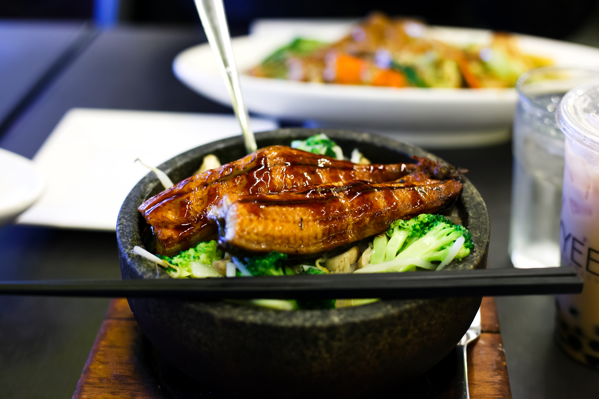

# 돼지고기 솥밥 🍲

> 사진: 돌솥 솥밥 예시 (출처: [Wikimedia Commons](https://commons.wikimedia.org/wiki/File:Eel_stone_bowl_rice.jpg), CC 라이선스)

고소한 돼지고기와 야채를 쌀과 함께 지어내는 든든한 한 그릇 솥밥입니다.

## 재료 (2인분)

### 밥
- 쌀 1.5컵 (300ml)
- 물 1.5컵 (쌀과 1:1 비율, 솥밥은 물을 약간 적게)
- 다시마 1조각 (선택)

### 돼지고기 양념
- 돼지고기 (앞다리살 또는 삼겹살) 200g
- 간장 1큰술
- 맛술(미림) 1큰술
- 다진 마늘 1작은술
- 참기름 1작은술
- 후추 약간

### 부재료
- 표고버섯 2~3개 (슬라이스)
- 당근 1/4개 (채썰기)
- 대파 1/2대

### 양념장
- 간장 2큰술
- 물 1큰술
- 고춧가루 1작은술
- 송송 썬 쪽파 1큰술
- 다진 마늘 1/2작은술
- 참기름 1작은술
- 통깨 약간

## 만드는 법

1. **쌀 불리기**: 쌀을 깨끗이 씻어 30분간 물에 불린 후 체에 밭쳐 물기를 뺍니다.

2. **고기 양념**: 돼지고기를 한입 크기로 썰어 간장, 맛술, 다진 마늘, 참기름, 후추로 밑간하여 10분간 재웁니다.

3. **재료 손질**: 표고버섯, 당근, 대파를 먹기 좋게 썹니다.

4. **고기 볶기**: 달군 팬에 양념한 돼지고기를 70% 정도 익을 때까지 볶습니다.

5. **솥에 안치기**: 솥(또는 냄비)에 불린 쌀을 넣고 물을 부은 뒤, 볶은 돼지고기와 표고버섯, 당근을 골고루 올립니다.

6. **밥 짓기**:
   - 센 불에서 끓어오를 때까지 가열 (약 5분)
   - 끓으면 약불로 줄여 12~15분간 익힙니다
   - 불을 끄고 뚜껑을 덮은 채 10분간 뜸 들입니다

7. **마무리**: 뜸이 끝나면 대파를 올리고 주걱으로 가볍게 섞어줍니다.

8. **양념장**: 분량의 재료를 모두 섞어 곁들입니다. 밥에 양념장을 조금씩 비벼 드세요.

## 팁 💡

- 누룽지를 좋아하면 마지막에 센 불로 30초~1분 더 가열하세요.
- 콩나물이나 무를 추가하면 더 풍성한 솥밥이 됩니다.
- 돌솥이 없으면 두꺼운 냄비로도 충분히 맛있게 됩니다.

**조리 시간**: 약 40분 (불리는 시간 제외) | **난이도**: ⭐⭐☆
