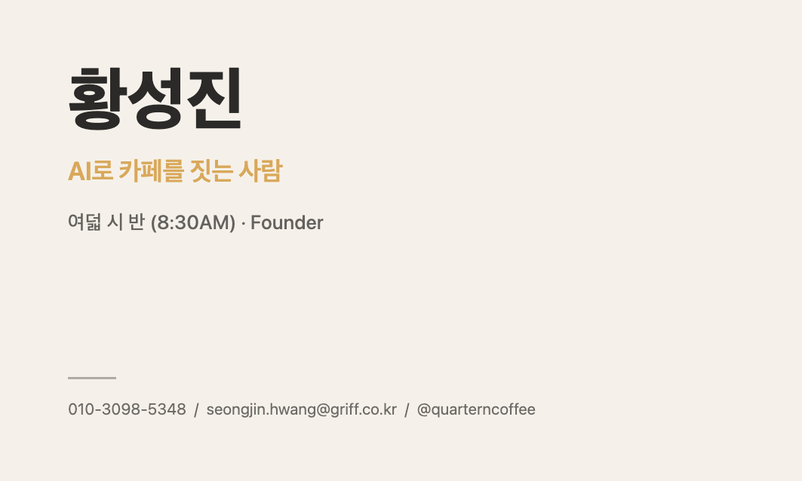
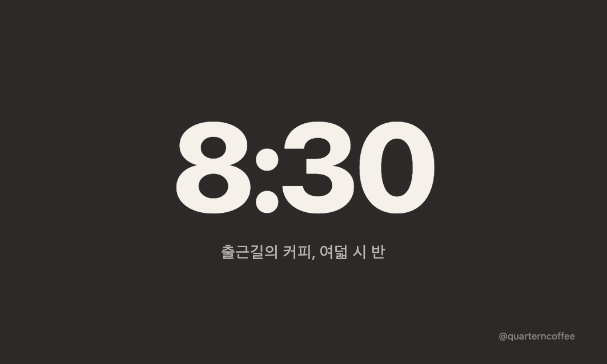

# 내 명함 만들기 — 황성진 (Quartern Coffee)

부트캠프 퀘스트 "내 명함 만들기" 제출물. 표준 명함 사이즈(90×54mm, 300DPI 기준 1063×638px)로 앞/뒤 2장을 순수 HTML/CSS로 제작했다. 외부 리소스(웹폰트/CDN/이미지) 없이 인라인 CSS + 시스템 폰트만 사용했다.

## 파일

- `front.html` — 앞면 (크림 바탕, 이름/태그라인/직함/연락처)
- `back.html` — 뒷면 (차콜 바탕, "8:30" 워드마크 + 슬로건)
- `screenshots/front-preview.png`, `screenshots/back-preview.png` — 렌더 스크린샷 (1063×638px)
- `command-input.txt` — 이 산출물을 만든 원본 입력 프롬프트

## 스펙 요약

- 사이즈: `html, body { width:1063px; height:638px; overflow:hidden }`, `@media print { @page { size: 90mm 54mm; margin:0 } }`
- 컬러 3색: 차콜 `#2B2A28`, 웜 크림 `#F5F1EA`, 모닝 골드 `#D9A85A`(강조 1요소 전용)
- 폰트: `-apple-system, "Apple SD Gothic Neo", sans-serif` 1패밀리, 웨이트 대비로 위계 구성

## 미리보기

### 앞면

### 뒷면

## 추가 산출물

- `card-front.pdf` / `card-back.pdf` — 인쇄용 PDF (90×54mm, @page 설정)
- `screenshots/agent-chat-card.png` — 에이전트 대화 스크린샷
- 나를 한 단어로 정의하면: **"짓는 사람"** — AI로 카페(여덟 시 반)를 짓는다
