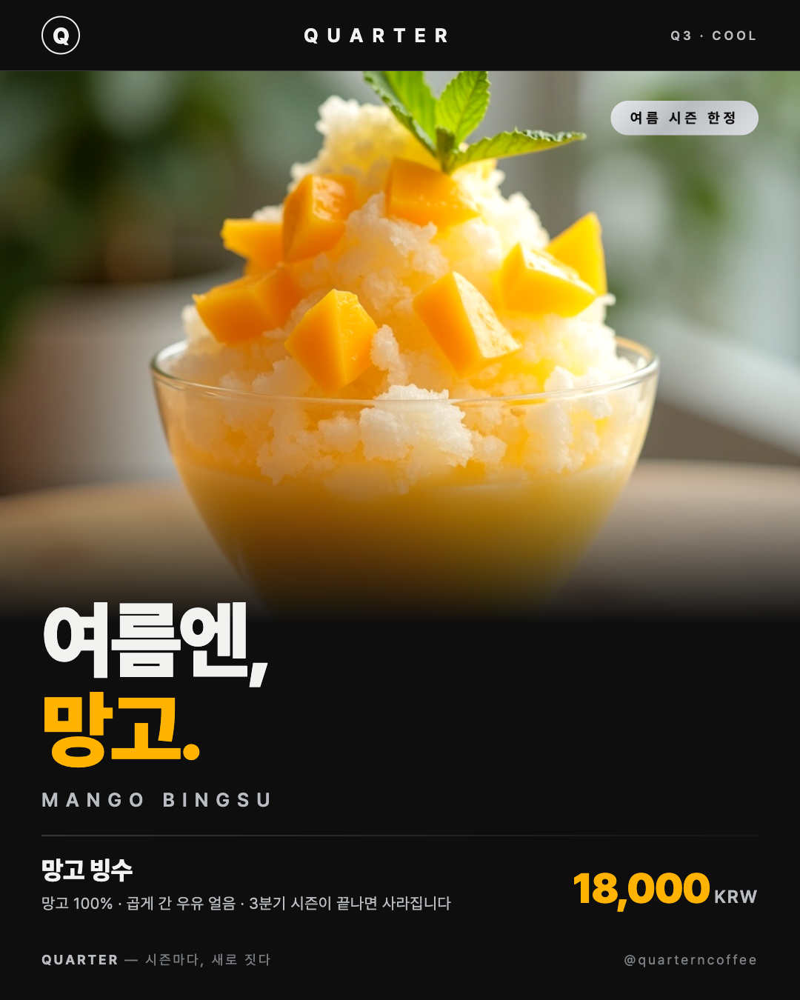

# QUARTER 신메뉴 포스터 (7주차 퀘스트 5: 카페 신메뉴 포스터 만들기)

노션 원본: https://ruucm.notion.site/Design-d237eb4baa8c83e7b1b381d46d79de94

5주차 `my_cafe.md`의 **QUARTER**(블랙·스테인리스 미니멀 프리미엄, "시즌마다, 새로 짓다") 브랜딩으로 만든
여름 시즌 한정 망고 빙수 포스터. 원래 `Week7/react-drawing/`의 망고 빙수 포스터 4종에서 파생한
5번째 버전이며, 인스타 게시용으로 이 폴더로 옮겼다.



## 스펙

- **사이즈**: 1080×1350 고정 (인스타 4:5) — Playwright 뷰포트 렌더 후 PNG 추출
- **구성**: 후킹 카피 "여름엔, 망고." 1줄 + 실사진 55% + 가격(18,000)/시즌 정보
- **제한**: 폰트 1종(Pretendard) · 컬러 3색(블랙 #0E0E0E / 스틸실버 #B9BDC1 / 망고옐로 #FFB300)
- **정적 HTML/CSS** (`index-quarter.html`) — 사진은 `photos/mango-bingsu-real.jpg` (fal.ai 생성, react-drawing과 동일 파일)

## 실게시 (퀘스트 필수 제출물)

[@quarterncoffee](https://www.instagram.com/quarterncoffee/) 피드 게시 완료 → **[게시물 링크](https://www.instagram.com/p/Da2-1Z5kneO/)**

- `screenshots/insta-quarter-post.jpg` — 게시물 화면
- `screenshots/insta-quarter-profile.jpg` — 프로필(게시물 1) 화면
- `screenshots/agent-chat-quarter-poster.png` — 에이전트 대화 스크린샷

## 렌더 방법

```bash
cd quarter-poster && python3 -m http.server 8931
# http://localhost:8931/index-quarter.html 을 1080×1350 뷰포트로 캡처
```
