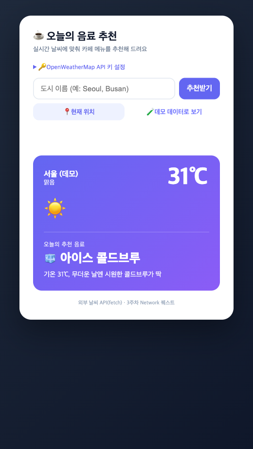
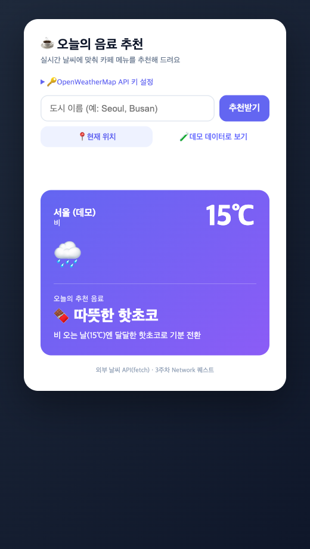

# ☕ 오늘의 음료 추천 위젯

도시(또는 현재 위치)의 실시간 날씨를 외부 API(`fetch`)로 불러와, 기온·날씨 상태에 맞는 카페 음료를 추천해 주는 단일 `index.html` 웹앱. 3주차 Network 퀘스트(`날씨기반_음료추천_위젯_퀘스트.md`)의 레퍼런스 구현.

## 실행 화면

더운 날 (31℃ 맑음) → 아이스 콜드브루:

비 오는 날 (15℃ 비) → 따뜻한 핫초코 (분기 로직이 다르게 동작):

## 사용 방법

1. `index.html`을 브라우저에서 연다 (빌드 도구 불필요).
2. 상단 "🔑 OpenWeatherMap API 키 설정"을 펼쳐 [openweathermap.org](https://openweathermap.org/api)에서 발급받은 무료 API 키를 입력한다. 키는 `localStorage`에만 저장된다.
3. 도시 이름(영문, 예: `Seoul`)을 입력하고 "추천받기"를 누른다.
4. 키가 없으면 "🧪 데모 데이터로 보기" 버튼으로 더운 날/추운 날/비 오는 날 화면과 분기 동작을 미리 확인할 수 있다 (누를 때마다 순환).

## 구현 기능

- 외부 날씨 API(OpenWeatherMap `Current Weather Data`) `fetch` 호출 → 현재 기온(℃)·날씨 상태 표시
- 기온 구간 + 날씨 상태(비/눈) 분기로 음료 1개 추천 + 추천 이유 한 줄
- 상태 처리: 로딩 스피너, 도시 없음(404)·키 오류(401)·쿼터 초과(429)·네트워크 오류 메시지 (앱이 멈추지 않음)
- API 키는 코드에 하드코딩하지 않고 입력창에서 받아 `localStorage`에 보관
- 고블린: 📍 현재 위치(Geolocation), 최근 조회 도시 3개 `localStorage` 저장, 데모 데이터 미리보기

## 추천 로직 요약

| 조건 | 추천 음료 |
|------|-----------|
| 비/이슬비/뇌우 | 따뜻한 핫초코 🍫 |
| 눈 | 따뜻한 카페라떼 ❄️ |
| 28℃ 이상 | 아이스 콜드브루 🧊 |
| 18~27℃ | 자몽 에이드 🍹 |
| 8~17℃ | 따뜻한 아메리카노 ☕ |
| 8℃ 미만 | 따뜻한 카페라떼 🔥 |

> 비/눈 같은 날씨 상태를 먼저 판정하고, 해당 없으면 기온 구간으로 분기한다.

## 파일

- `index.html` — 앱 본체 (단일 파일)
- `screenshot.png`, `screenshot-rain.png` — 실행 화면
- `command-input.txt` — 생성 명령 기록
