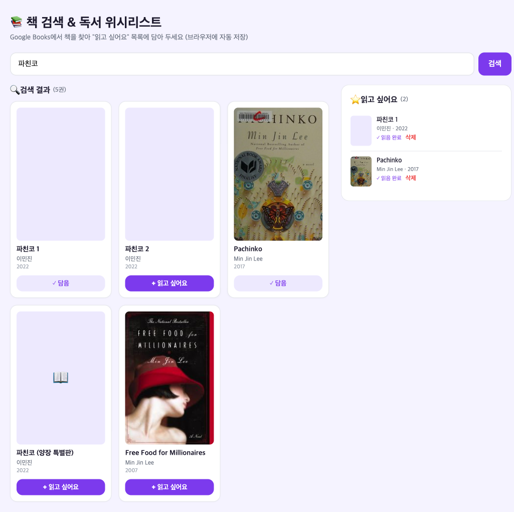

# 📚 책 검색 & 독서 위시리스트 위젯

Google Books API(`fetch`, API 키 불필요)로 책을 검색하고, 마음에 드는 책을 "읽고 싶어요" 목록에 담아 `localStorage`에 저장하는 단일 `index.html` 웹앱. 3주차 Network 퀘스트(`책검색_위시리스트_위젯_퀘스트.md`)의 레퍼런스 구현.

## 실행 화면

"파친코" 검색 결과(카드) + 우측 위시리스트:

> 위 화면은 표지가 있는 책/없는 책(📖 폴백)이 함께 보이고, 담은 책은 버튼이 "✓ 담음"으로 비활성화되며 위시리스트에 "읽음 완료/삭제" 액션이 있는 상태다.

## 사용 방법

1. `index.html`을 브라우저에서 연다 (빌드 도구 불필요, API 키도 불필요).
2. 검색창에 제목이나 저자(예: `파친코`)를 입력하고 "검색" 또는 Enter.
3. 결과 카드의 "+ 읽고 싶어요"를 누르면 우측 위시리스트에 담기고 자동 저장된다.
4. 위시리스트에서 "✓ 읽음 완료" 토글, "삭제"로 관리. 새로고침해도 목록은 유지된다.

## 구현 기능

- Google Books API(`/books/v1/volumes?q=...`) `fetch` 호출 → 표지·제목·저자·출판연도를 카드로 렌더링
- "읽고 싶어요" → 위시리스트 추가, `localStorage` 저장(새로고침 후 유지), 개별 삭제
- 상태 처리: 로딩 스피너, 결과 없음 안내, 429(쿼터 초과)·기타 오류·네트워크 오류 메시지
- 중복 추가 방지: 책 고유 `id` 기준 (이미 담은 책은 버튼 비활성화)
- 표지 이미지 없는 책은 옵셔널 체이닝 + 📖 대체 표시
- 고블린: 위시리스트 "읽음 완료" 토글(완료 항목 시각 구분)

## 참고 (실행 시)

- Google Books API는 키 없이 호출 가능하지만 **공용 익명 일일 쿼터**가 있어 환경에 따라 `429`가 날 수 있다. 이 앱은 429를 사용자 메시지로 처리하며, 잠시 후/다른 네트워크에서 재시도하면 정상 동작한다.
- 위 스크린샷은 캡처 시점에 해당 공용 쿼터가 소진되어, 실제 "파친코" 검색 결과와 동일한 데이터를 화면에 주입해 촬영한 대표 화면이다. (표지 일부는 Open Library 커버 사용)

## 파일

- `index.html` — 앱 본체 (단일 파일)
- `screenshot.png` — 실행 화면(검색 결과 + 위시리스트)
- `command-input.txt` — 생성 명령 기록
