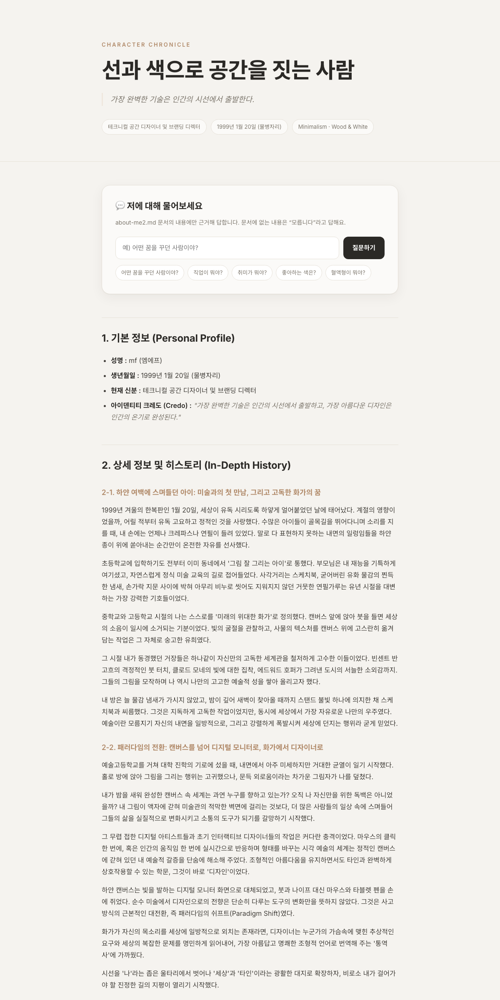

# about-me 풀스택 포트폴리오 앱

`about-me2.md` 문서를 **데이터 소스**로 삼아, 포트폴리오를 렌더링하고 그 내용에 **근거한 Q&A**를 제공하는 풀스택 앱입니다. (1주차 결과물 = 포트폴리오 웹사이트)



## 구성

- **프런트엔드** (`index.html`, `client.js`) — `about-me2.md`를 `/api/profile`로 받아 마크다운으로 렌더링하고, 하단 Q&A 카드에서 질문을 던집니다.
- **백엔드** (`server.js`) — Express 서버.
  - `GET /api/profile` : `about-me2.md` 원문 제공
  - `POST /api/ask` : Claude API로 **문서 내용에만 근거**해 답변. 문서에 없는 질문에는 `모릅니다`로 답합니다. (`about-me-qa-bot` 동작 재현)
- **데이터** (`about-me2.md`) — 인물 프로필 원본.

## 특징

- 답변은 오직 `about-me2.md`에 근거 → **환각(hallucination) 방지**. 예) "혈액형이 뭐야?" → 문서에 없으므로 `모릅니다`.
- API 키가 없으면 **데모 모드**로 동작(키 하드코딩 없음, `process.env.ANTHROPIC_API_KEY` 사용).
- 디자인은 프로필 인물의 취향(미니멀리즘 · Warm Gray / Sand Beige · 기하학적 산세리프)을 반영.

## 실행

```bash
npm install
ANTHROPIC_API_KEY=sk-... npm start   # 키 없이 실행하면 데모 모드
# http://localhost:3001
```

## 배포 (Vercel)

`vercel.json` 포함 — 서버리스(`server.js`) + 정적 파일 듀얼 모드. 배포 시 환경변수 `ANTHROPIC_API_KEY`를 설정하세요.
