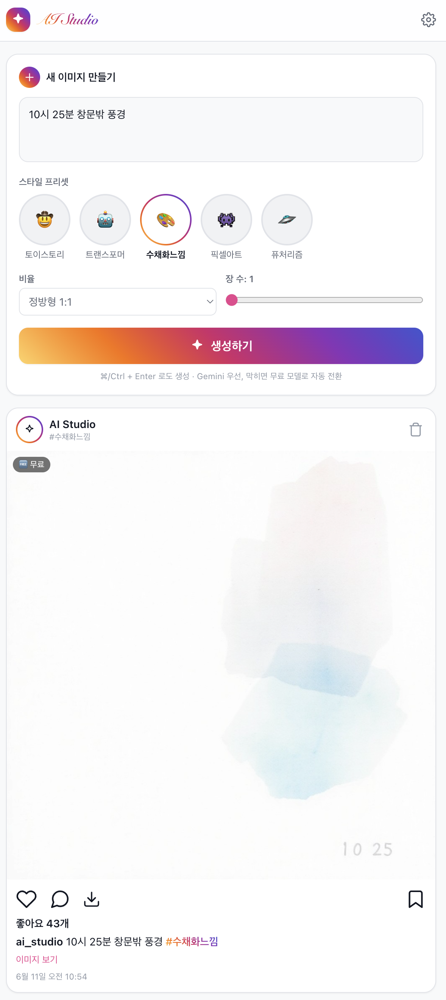

# 🎨 AI Image Studio

인스타그램 스타일의 **AI 이미지 생성 웹앱**. 프롬프트를 입력하면 AI가 이미지를 만들어 피드에 쌓아줍니다.
단일 `index.html` 파일 하나로 동작하며, 빌드 도구가 필요 없습니다.

  

<p align="center">
  
</p>

---

## ✨ 주요 기능

- **텍스트 → 이미지 생성** (Midjourney 처럼 프롬프트 기반)
- **스타일 프리셋 5종** — 선택 시 프롬프트에 스타일이 자동 적용됩니다
  - 🤠 토이스토리 · 🤖 트랜스포머 · 🎨 수채화느낌 · 👾 픽셀아트 · 🛸 퓨처리즘
- **인스타그램 스타일 UI** — 그라데이션 로고/버튼, 스토리형 아바타, 정사각 피드 카드, 하트·댓글·공유·북마크 액션바
- **옵션** — 비율(1:1 / 3:4 / 4:3 / 9:16 / 16:9), 장수(1~4장), `⌘/Ctrl + Enter` 단축키
- **피드** — 생성물 최신순 누적, `localStorage` 저장(새로고침 유지), 다운로드 · 전체보기(라이트박스) · 삭제
- **출처 배지** — 각 이미지가 어떤 엔진으로 만들어졌는지 표시 (`✦ Gemini` / `🆓 무료`)

---

## 🔀 하이브리드 백엔드

이미지가 항상 나오도록 **2단계 폴백** 구조로 동작합니다.

| 순위 | 엔진 | 설명 |
|---|---|---|
| 1순위 | **Google Gemini** (`gemini-2.5-flash-image`) | Gemini 키가 있을 때 먼저 사용. 응답의 base64 이미지를 즉시 표시 |
| 2순위 | **Pollinations** (`gen.pollinations.ai/image`) | Gemini가 실패(quota·인증·차단 등)하거나 키가 없으면 자동 전환. 무료 |

> Gemini 키 없이 **Pollinations 키만으로도** 완전히 동작합니다.

---

## 🚀 실행 방법

CDN과 `fetch`를 사용하므로 `file://`로 직접 열지 말고 **로컬 서버**로 실행하세요.

```bash
cd 0609NewTesttt/homework/ai-image-studio2
python3 -m http.server 5523
```

브라우저에서 **http://localhost:5523** 접속.

---

## 🔑 API 키 발급 (둘 중 하나면 충분, Pollinations 추천)

> 보안을 위해 키는 코드에 하드코딩되어 있지 않습니다. 앱의 **⚙️ 설정**에서 입력하면 브라우저 `localStorage`에만 저장됩니다.

### 1) Pollinations (무료 · 추천)
1. <https://enter.pollinations.ai> 접속 → **GitHub 로그인** (첫 로그인 시 무료 Seed 등급 자동 부여)
2. 콘솔에서 **`+ API Key`** → **Create** → 생성된 **`sk_...`** 키 복사
   - 현재 `pk_`(publishable) 키는 폐지되어, UI에서는 **Secret(`sk_`)** 키만 생성됩니다.
   - 본 앱은 **로컬 전용**이고 키가 브라우저에만 저장되므로 `sk_` 사용이 안전합니다. (웹에 공개 배포할 경우엔 권장하지 않음)
3. 앱 **⚙️ → "🆓 Pollinations 키"** 칸에 붙여넣기 → 저장

### 2) Google Gemini (선택)
1. <https://ai.dev> 에서 API 키 발급 (형식: `AQ....`)
2. 앱 **⚙️ → "✦ Google Gemini 키"** 칸에 입력 → 저장
   - 무료 등급은 **일일 이미지 quota 제한**이 있어, 소진되면 자동으로 Pollinations로 전환됩니다.

---

## 🛠 기술 스택

- **React 18** + **ReactDOM** + **Babel Standalone** (브라우저 내 JSX 변환) — 모두 CDN
- **Tailwind CSS** (CDN)
- 빌드/번들러 **없음** — `index.html` 단일 파일
- 상태 저장: 브라우저 `localStorage`

---

## 📁 구조

```
ai-image-studio2/
├── index.html   # 앱 전체 (UI + 하이브리드 생성 로직)
└── README.md
```

---

## ⚠️ 참고

- 키는 절대 코드/저장소에 커밋하지 마세요. 본 저장소의 `index.html`에는 키가 들어있지 않습니다.
- Pollinations 무료(Seed) 등급은 레이트 제한이 있어, 천천히 생성하면 무료로 충분합니다.
- 생성 이미지는 모델·프롬프트에 따라 결과가 달라질 수 있습니다.
