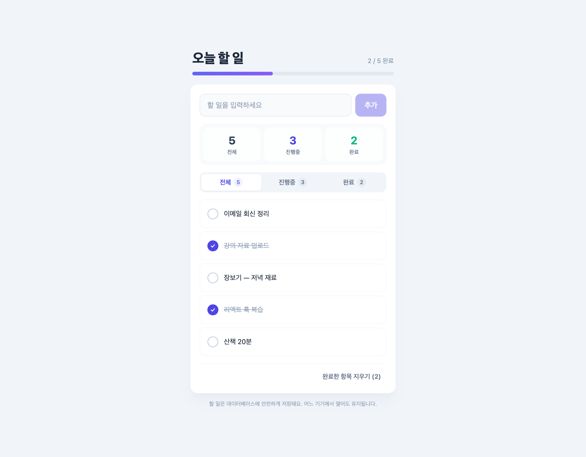

# 📋 오늘 할 일 (React + Express + PostgreSQL)

진행률 바와 통계가 있는 Todo 앱입니다. 할 일을 **추가 · 완료 토글 · 삭제** 하고
**전체 / 진행중 / 완료** 로 필터링할 수 있습니다. 모든 항목은 **Supabase PostgreSQL** 에
저장되어 어느 기기에서 열어도 유지됩니다.



> 스크린샷의 목록은 데모 데이터입니다. 실제 데이터는 `.env` 의 `DATABASE_URL` 로 연결된 DB에 저장됩니다.

## 주요 기능

- 📊 상단 진행률 바 + 전체/진행중/완료 통계 카드
- ➕ 할 일 추가 (연속 입력을 위해 추가 후 포커스 유지)
- ✅ 커스텀 원형 체크박스 + 체크 시 팝 애니메이션
- 🗑️ 개별 삭제(낙관적 업데이트 + 실패 시 롤백) · 완료 항목 일괄 삭제
- 🔎 전체 / 진행중 / 완료 필터 탭 (각 개수 표시)
- ⚠️ 오류 배너(직접 닫기 가능) · 비어 있을 때 안내(Empty State)
- 📱 반응형 + 부드러운 진입 애니메이션, 커스텀 스크롤바

## 실행 방법

```bash
cd Week4/Goblin4/03
npm install
npm start          # node server.js
```

브라우저에서 **http://localhost:3000** 접속.

> `.env` 의 `DATABASE_URL` 을 읽도록 실행해야 합니다. 필요 시
> `node --env-file=.env server.js` 로 실행하세요.

## 데이터 저장

`.env` 의 `DATABASE_URL` (Supabase PostgreSQL) 로 연결됩니다. `.env` 는
`.gitignore` 처리되어 커밋되지 않습니다. 첫 요청 시 `todos` 테이블이 없으면
자동 생성됩니다.

## 구성

| 파일 | 역할 |
|------|------|
| `index.html` | React(CDN) + Tailwind 단일 파일 프론트엔드 |
| `server.js`  | Express REST API + 정적 서빙 (로컬 + Vercel 듀얼 모드) |
| `vercel.json` | Vercel 배포 설정 |

## API

| 메서드 | 경로 | 설명 |
|--------|------|------|
| GET    | `/api/todos`            | 할 일 목록 (최신순) |
| POST   | `/api/todos`            | 할 일 추가 `{ text }` |
| PATCH  | `/api/todos/:id`        | 완료 상태 토글 |
| DELETE | `/api/todos/:id`        | 할 일 삭제 |
| DELETE | `/api/todos/completed`  | 완료한 항목 일괄 삭제 |

모든 쿼리는 파라미터 바인딩(`$1, $2`)으로 SQL 인젝션을 방지합니다.
