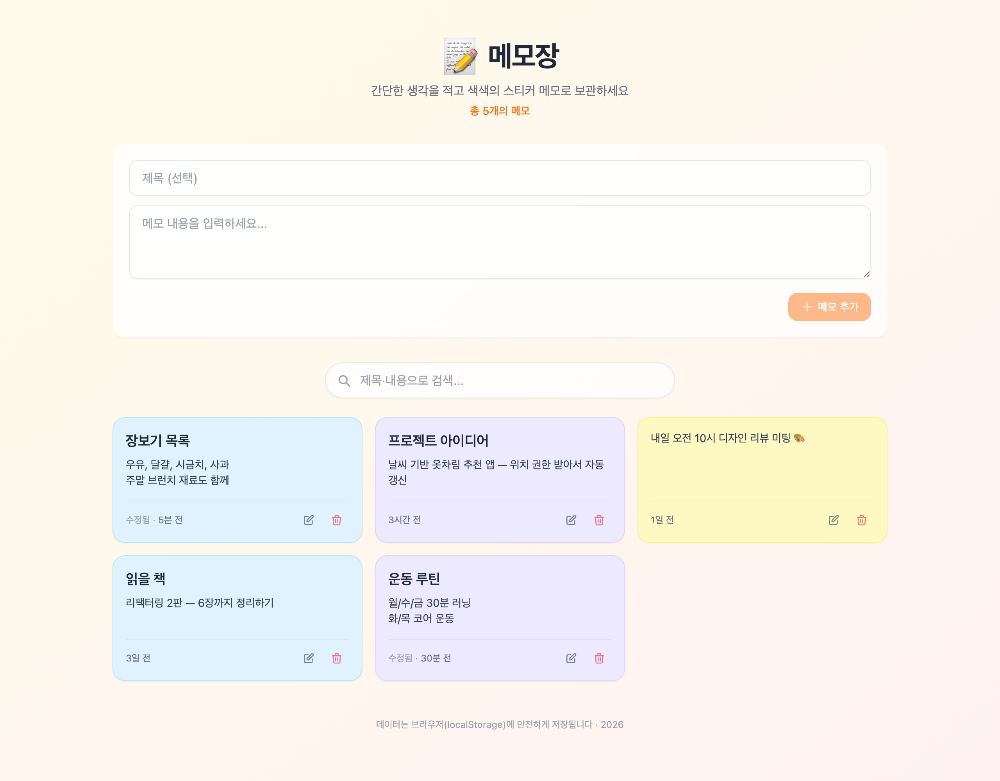

# 📝 메모장 (React · localStorage)

색색의 스티커 메모를 **작성 · 검색 · 수정 · 삭제(CRUD)** 할 수 있는 단일 파일 앱입니다.
서버 없이 동작하며, 모든 메모는 **브라우저 localStorage** 에 저장됩니다.



> 스크린샷의 메모는 데모 데이터입니다.

## 주요 기능

- ✍️ 제목(선택) + 내용으로 메모 작성
- 🎨 메모 ID 기반 자동 파스텔 색상 (6색 팔레트)
- 🔎 제목·내용 실시간 검색
- ✏️ 모달로 메모 수정 (ESC/바깥 클릭으로 닫기)
- 🗑️ 인라인 삭제 확인(4초 후 자동 취소)
- 🕒 "방금 전 / n분 전 / 수정됨" 상대 시간 표시
- 📭 비어 있을 때 / 검색 결과 없을 때 안내 화면
- 📱 1~3열 반응형 그리드 + 진입 애니메이션

## 실행 방법

별도 빌드나 서버가 필요 없습니다. 파일을 그대로 열면 됩니다.

```bash
cd Week4/Goblin4/04_memo
open index.html          # 또는 브라우저로 드래그
```

> 일부 브라우저는 `file://` 환경에서 CDN 스크립트를 제한할 수 있습니다.
> 그럴 땐 간단한 정적 서버로 여세요: `python3 -m http.server` 후
> `http://localhost:8000` 접속.

## 데이터 저장

| 항목 | 값 |
|------|-----|
| 저장소 | 브라우저 `localStorage` |
| 키 | `memo_app_memos_v1` |
| 형식 | `{ id, title, body, createdAt, updatedAt }` 배열 |

> 같은 브라우저에서만 유지되며, 다른 기기와 동기화되지 않습니다.

## 구성

| 파일 | 역할 |
|------|------|
| `index.html` | React(CDN) + Tailwind 단일 파일 (앱 전체) |
