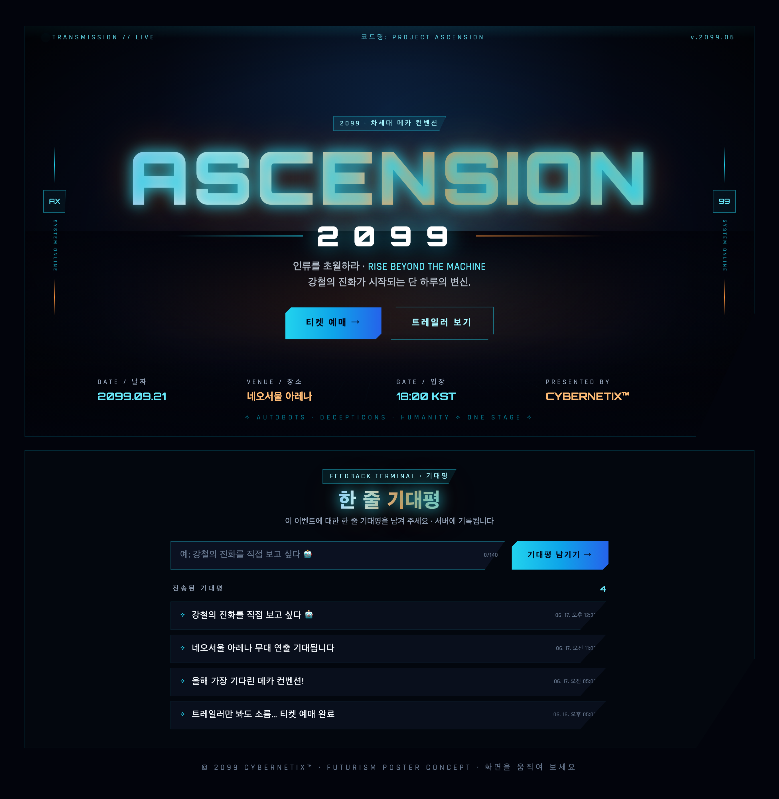

# 🛰️ ASCENSION 2099 — Futurism Poster

미래주의(futurism) 컨셉의 인터랙티브 이벤트 포스터입니다. 마우스를 움직이면
배경이 시차(parallax)로 반응하고, 하단에는 방문자가 **한 줄 기대평** 을 남길 수 있는
피드백 터미널이 있습니다. 기대평은 서버의 `reviews.json` 에 저장됩니다.



> 스크린샷의 기대평은 데모 데이터입니다.

## 주요 기능

- 🌌 네온 글로우 타이틀, 홀로그램 그리드 바닥, 스캔라인 등 CSS 애니메이션
- 🖱️ 마우스 위치에 반응하는 배경 패럴랙스
- 🎟️ 티켓 예매 / 트레일러 보기 등 네온 CTA 버튼
- 📅 날짜·장소·입장 시간 등 포스터 정보 스트립
- 💬 한 줄 기대평 작성 + 목록(최신순, 글자 수 카운터, 140자 제한)
- 📱 16:9 반응형 레이아웃

## 실행 방법

```bash
cd Week4/Goblin4/futurism-poster
npm install
npm start          # node server.js
```

브라우저에서 **http://localhost:3001** 접속.

## 데이터 저장

외부 DB 없이 같은 폴더의 **`reviews.json`** 파일에 기대평을 저장합니다.

```
reviews.json
[ { "id": 1718600000000, "text": "...", "createdAt": "2099-..." } ]
```

## 구성

| 파일 | 역할 |
|------|------|
| `index.html`  | React(CDN) + Tailwind 단일 파일 프론트엔드 |
| `server.js`   | Express REST API + 정적 서빙 (로컬 + Vercel 듀얼 모드) |
| `reviews.json`| 기대평 저장 파일 |

## API

| 메서드 | 경로 | 설명 |
|--------|------|------|
| GET    | `/api/reviews` | 기대평 목록 (최신순) |
| POST   | `/api/reviews` | 기대평 등록 `{ text }` (최대 140자) |
