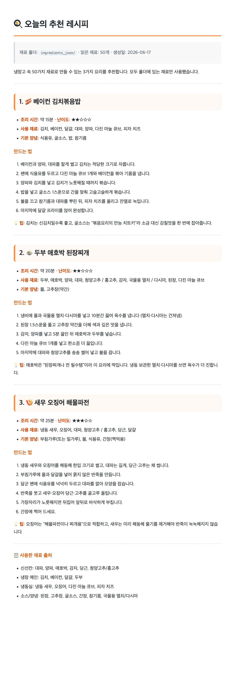
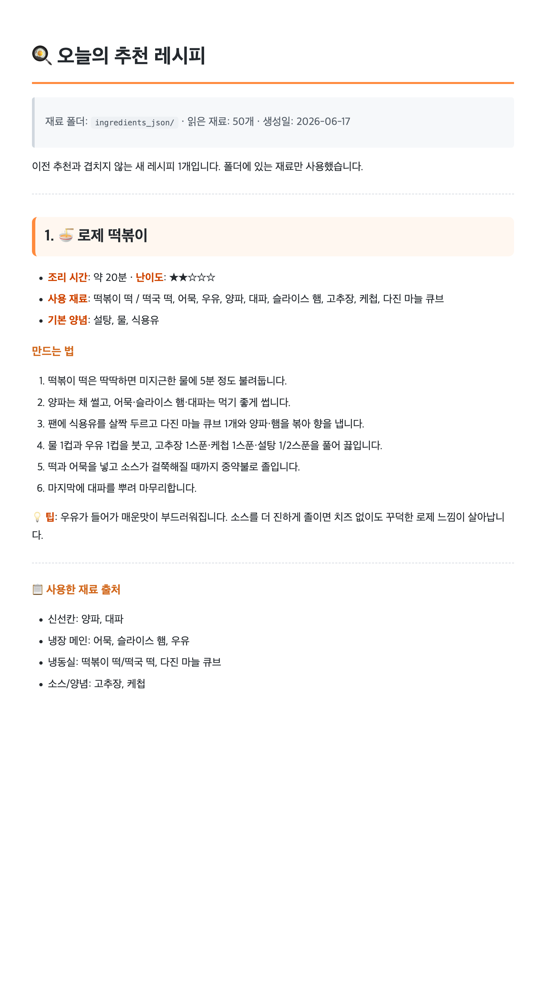
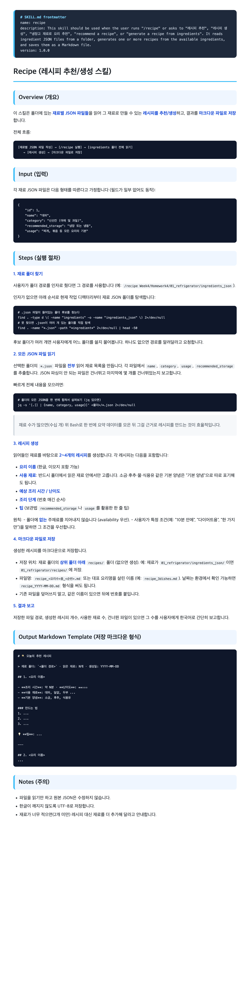

# 🧊 냉장고 재료 레시피 추천기 (Refrigerator Recipe Recommender)

냉장고 속 재료를 **재료별 JSON 파일**로 관리하고, `/recipe` 스킬로 그 재료를 읽어 **레시피를 생성**한 뒤 **마크다운 + 스크린샷**으로 정리하는 프로젝트입니다.

## 📂 폴더 구조

```
01_refrigerator/
├── gemini-code-1781669796315.py   # 재료 50종 → JSON 생성 스크립트
├── ingredients_json/              # 재료별 JSON 50개 (NN_영문명.json)
│   ├── 01_green_onion.json
│   ├── 02_onion.json
│   └── ... (총 50개)
└── recipes/                       # 생성된 레시피 + 스크린샷
    ├── recipe_2026-06-17.md       # 추천 레시피 3품
    ├── recipe_2026-06-17_2.md     # 로제 떡볶이 (치즈 제외)
    ├── recipe_screenshot.png
    └── recipe_screenshot_2.png
```

## 🔄 동작 흐름

```
[재료별 JSON 작성] → [/recipe 실행] → [ingredients_json 폴더 전체 읽기]
   → [레시피 생성] → [마크다운 저장] → [스크린샷 캡처]
```

## 📸 결과 스크린샷

### 1. 추천 레시피 3품
> 냉장고 재료 50종으로 만든 베이컨 김치볶음밥 · 두부 애호박 된장찌개 · 새우 오징어 해물파전



### 2. 로제 떡볶이 (치즈 제외)
> `/recipe` 스킬로 추가 생성 후, 요청에 따라 치즈를 뺀 버전



### 3. `/recipe` 명령어(스킬) 정의
> 레시피를 생성하는 `/recipe` 스킬의 정의 파일(`SKILL.md`) — 프론트매터와 실행 절차



## 🍳 생성된 레시피 목록

| 파일 | 레시피 | 비고 |
|------|--------|------|
| `recipe_2026-06-17.md` | 베이컨 김치볶음밥 / 두부 애호박 된장찌개 / 새우 오징어 해물파전 | 첫 추천 3품 |
| `recipe_2026-06-17_2.md` | 로제 떡볶이 | 치즈 제외 버전 |

## ⚙️ 사용한 도구

- **`gemini-code-1781669796315.py`** — 재료 50종 데이터를 개별 JSON으로 생성
- **`/recipe` 스킬** (`.claude/skills/recipe/`) — 폴더의 JSON을 읽어 레시피를 마크다운으로 저장
- **headless Chrome** — 마크다운을 렌더링해 스크린샷(PNG) 캡처

## 📝 재료 JSON 형식

```json
{
    "id": 1,
    "name": "대파",
    "category": "신선칸 (야채 및 과일)",
    "recommended_storage": "냉장 또는 냉동",
    "usage": "찌개, 볶음 등 모든 요리의 기본"
}
```

> 파일명은 `NN_영문명.json` 형식(예: `01_green_onion.json`)이며, JSON 내부의 `name` 등 값은 한글을 유지합니다.
