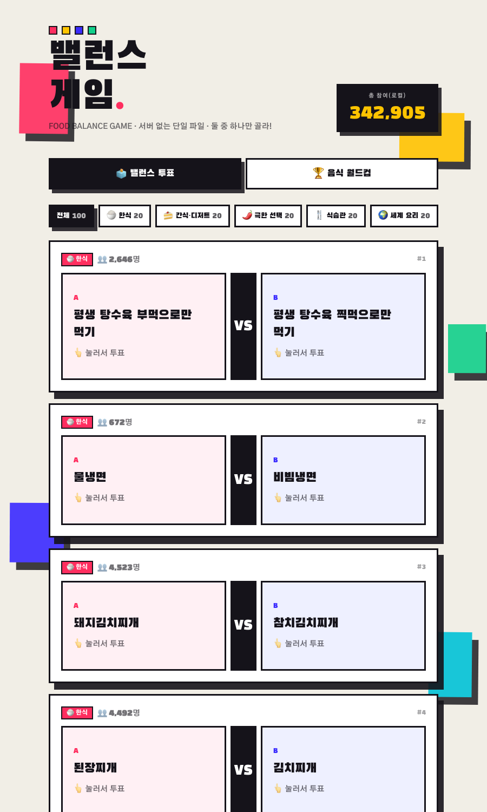

# 🍚 음식 밸런스 게임 — 서버 없는 단일 파일 버전

기존 풀스택 앱 **실시간 밸런스 게임(Food Balance)** 을 백엔드 없이 동작하는
**단일 `index.html`** (CDN React 18 + Tailwind) 로 새로 만든 버전입니다.
빌드 도구·서버·DB 없이 브라우저에서 바로 열면 됩니다.



## 실행 방법

빌드 불필요. 둘 중 아무거나:

```bash
# 1) 정적 서버
npx serve .
# → http://localhost:3000

# 2) VS Code Live Server 확장으로 index.html 우클릭 → "Open with Live Server"
# 3) 그냥 index.html 더블클릭 (file:// 로도 동작 — 외부 fetch가 없어서 가능)
```

## 자체완결형 (핵심)

- `Food Balance.json` 의 **카테고리 + 100문제를 JS 배열로 그대로 임베드**했습니다.
  외부 `fetch` 전혀 없음 → 단일 파일만 있으면 동작.
- `option_A`/`option_B`(JSON) → `optionA`/`optionB`(컴포넌트) 로 매핑.
- 모든 CDN URL은 버전 고정(React `18.3.1`, ReactDOM `18.3.1`, Babel `7.25.9`, Tailwind `3.4.16`).

## 두 가지 모드

### 1) 🗳 밸런스 투표
- 카테고리 탭(전체 / 한식 / 간식·디저트 / 극한 선택 / 식습관 / 세계 요리)으로 100문제 필터. 각 카테고리 20문제.
- A vs B 중 하나를 누르면 결과 막대(%)가 나타나고 1인 1표로 잠깁니다(`MY PICK` 표시).
- **로컬 집계**: 서버가 없으므로 투표는 `localStorage` 에 누적됩니다 (UI에 "로컬 집계" 명시).

### 2) 🏆 음식 월드컵 (토너먼트)
- 음식 항목이 명확한 카테고리(한식·간식디저트·세계요리)의 선택지로 후보 풀(중복 제거, 약 120종) 구성.
- 8강 / 16강 / 32강 중 선택 → 매치업을 토너먼트로 진행 → 우승 메뉴 결정.
- 결과는 **명예의 전당**(localStorage)에 우승 횟수·매치 승률로 누적·랭킹.

## localStorage 투표 처리 (서버 집계 대체)

원본은 PostgreSQL 에 득표를 저장하고 2.5초 폴링으로 실시간 갱신했는데, 서버가 없으므로 다음으로 대체:

| 항목 | 키 | 내용 |
|---|---|---|
| 가상 기준 득표 | (저장 안 함) | 질문 `id` 기반 **결정적 시드**(`Math.sin` 해시)로 600~6000표·A비율 25~75% 생성 → 새로고침해도 막대가 출렁이지 않음 |
| 내 투표 누적 | `fbg_local_votes_v1` | 질문별 `{a, b}` 증가분만 저장 |
| 1인 1표 잠금 | `fbg_my_choice_v1` | 질문별 내 선택(`'a'`/`'b'`) → 재투표 방지 + `MY PICK` 강조 |
| 토너먼트 통계 | `fbg_tournament_stats_v1` | 항목별 `{wins, picks, matches}` |

- **표시 득표 = 시드(id) + 내 누적** → 결정적 기준 위에 내 표만 얹으므로 자연스럽고 안정적.
- 퍼센트는 `percentB = 100 - round(percentA)` 로 항상 합이 100.

## 월드컵 로직 (원본 집계식 그대로 이식)

- 후보를 셔플 후 N개 선택 → 2개씩 매치 → 승자만 다음 라운드 진출, 1명 남으면 우승.
- 진행률 바·라운드명(`32강 → … → 결승`) 표시.
- 결과 집계: **승자 = picks+1·matches+1, 패자 = matches+1, 우승자 = wins+1**.
- 명예의 전당 정렬: `wins → picks → matches` 순, 승률 = `round(picks/matches*100)`.

## 디자인

원본의 네오브루탈리즘 포스터 무드를 그대로 재현: `Black Han Sans` 디스플레이 폰트,
굵은 검정 테두리 + 입체 그림자(`block3d`), 하프톤 점 텍스처, 떠다니는 3D 컬러 블록,
음식 테마 색(레드/옐로/블루/시안/그린), 막대·pop·fade 부드러운 전환. 모바일 반응형.

## 원본 대비 변경점

- 백엔드(Express/PostgreSQL)·실시간 폴링 제거 → 로컬 집계로 대체.
- 서버에 의존하던 **질문 등록 폼 / 질문 삭제**는 제거(고정 100문제 코어이므로 정적 데이터에서 의미 없음).
