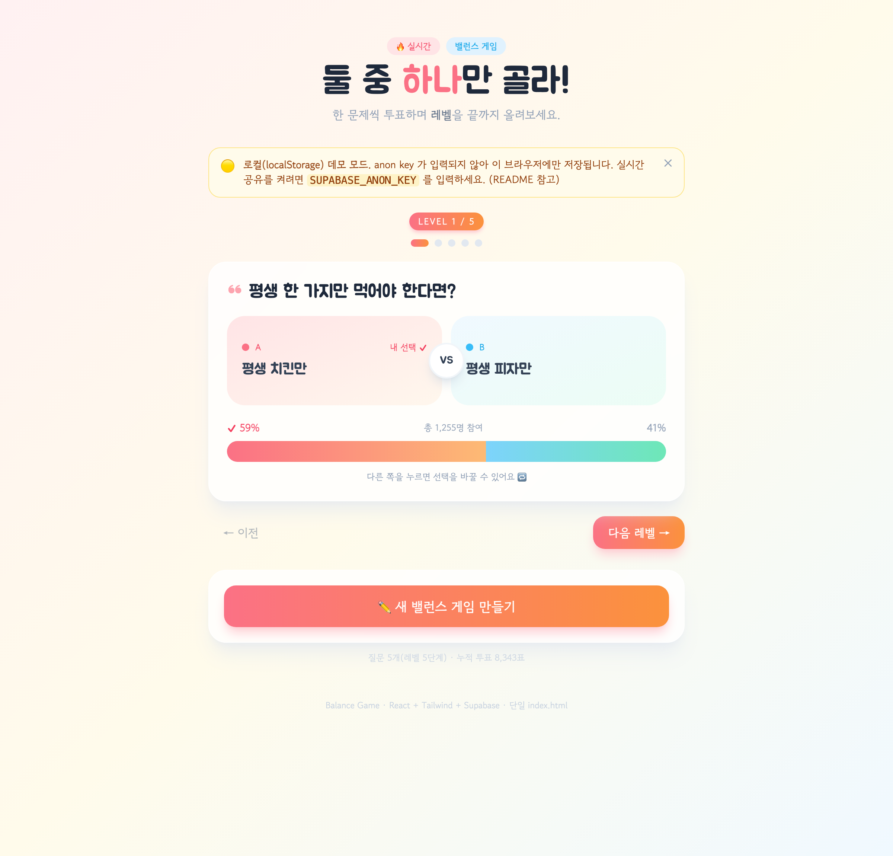

# 🔥 실시간 밸런스 게임 (Balance Game)

"A vs B" 형태의 밸런스 게임 질문을 등록하고, **한 문항씩 레벨을 올리며** 실시간 투표 비율을 확인하는 단일 파일 웹앱입니다.

- **단일 파일**: `index.html` 하나로 동작 (빌드 도구 불필요)
- **레벨 진행**: 질문을 한 개씩 보여주고 투표하면 다음 레벨로 진행. 등록한 **질문 수만큼 레벨이 자동 생성**되며, 모두 풀면 완료 화면
- **기술 스택**: CDN 기반 React 18 + Tailwind CSS + Supabase JS v2
- **저장소**: Supabase(PostgreSQL) 우선, 연결 불가 시 **localStorage 자동 fallback**
- **실시간**: Supabase Realtime(`postgres_changes`) 구독으로 다른 사용자 화면에도 투표가 즉시 반영

---

## 🖼️ 화면



> `LEVEL n / N` 진행 바 · 한 문항씩 표시 · VS 분할 레이아웃(따뜻한 색 A vs 시원한 색 B) · 투표하면 퍼센티지 바와 총 참여자 수가 갱신되고 “다음 레벨”로 진행됩니다. (다른 쪽을 누르면 선택 변경 가능)

---

## 📂 파일 구성

| 파일 | 설명 |
| --- | --- |
| `index.html` | 앱 본체 (React 컴포넌트 + 데이터 레이어 전부 포함) |
| `README.md` | 이 문서 (설정 · 실행 안내) |

---

## 🚀 가장 빠르게 실행하기 (설정 없이 데모)

anon key 없이도 **바로 동작**합니다. (이 경우 localStorage 데모 모드로, 해당 브라우저에만 데이터가 저장됩니다.)

```bash
# 방법 1) 그냥 파일 열기
open index.html      # macOS

# 방법 2) 간단한 로컬 서버 (권장)
npx serve .
# 또는
python3 -m http.server 8000
```

브라우저에서 상단에 🟡 **"로컬(localStorage) 데모 모드"** 배너가 보이면 정상입니다.

---

## ⚙️ Supabase 실시간 모드로 켜기 (3단계)

실제로 여러 사용자 간 실시간 공유를 하려면 아래 3단계를 진행하세요.

### 1단계. 테이블 · 함수 · 권한 SQL 실행

Supabase 대시보드 → **SQL Editor** → 아래 SQL을 붙여넣고 **Run**.

```sql
-- 1) 질문 테이블
create table if not exists public.balance_questions (
  id          uuid primary key default gen_random_uuid(),
  title       text not null,
  option_a    text not null,
  option_b    text not null,
  votes_a     int  not null default 0,
  votes_b     int  not null default 0,
  created_at  timestamptz not null default now()
);

-- 2) 투표 증가 RPC (동시성 안전: update ... set votes = votes + 1)
create or replace function public.increment_vote(question_id uuid, choice text)
returns void
language plpgsql
security definer
set search_path = public
as $$
begin
  if choice = 'a' then
    update public.balance_questions
       set votes_a = votes_a + 1
     where id = question_id;
  elsif choice = 'b' then
    update public.balance_questions
       set votes_b = votes_b + 1
     where id = question_id;
  else
    raise exception 'invalid choice: %', choice;
  end if;
end;
$$;

-- 2-1) 선택 변경 RPC (이전 표 차감 + 새 표 증가, 한 트랜잭션)
create or replace function public.change_vote(question_id uuid, old_choice text, new_choice text)
returns void
language plpgsql
security definer
set search_path = public
as $$
begin
  if new_choice not in ('a','b') or old_choice not in ('a','b') then
    raise exception 'invalid choice';
  end if;
  if old_choice = new_choice then
    return; -- 변화 없음
  end if;
  update public.balance_questions
     set votes_a = greatest(0, votes_a - (old_choice = 'a')::int) + (new_choice = 'a')::int,
         votes_b = greatest(0, votes_b - (old_choice = 'b')::int) + (new_choice = 'b')::int
   where id = question_id;
end;
$$;

-- 3) Row Level Security 활성화
alter table public.balance_questions enable row level security;

-- 4) anon 역할에 select / insert / update 허용 정책
--    (데모용 공개 정책입니다. 운영 시 필요에 맞게 조이세요.)
drop policy if exists "anon select" on public.balance_questions;
create policy "anon select" on public.balance_questions
  for select to anon using (true);

drop policy if exists "anon insert" on public.balance_questions;
create policy "anon insert" on public.balance_questions
  for insert to anon with check (true);

drop policy if exists "anon update" on public.balance_questions;
create policy "anon update" on public.balance_questions
  for update to anon using (true) with check (true);

-- 5) RPC 실행 권한을 anon 에 부여
grant execute on function public.increment_vote(uuid, text) to anon;
grant execute on function public.change_vote(uuid, text, text) to anon;

-- 6) Realtime publication 에 테이블 추가 (실시간 구독용)
alter publication supabase_realtime add table public.balance_questions;
```

> 참고: `increment_vote` 는 `security definer` 라서 RLS update 정책 없이도 동작하지만,
> 위 SQL에는 안전하게 둘 다 포함했습니다. publication 추가가 이미 되어 있어 에러가 나면 그 줄만 건너뛰면 됩니다.

### 2단계. anon public key 입력

1. Supabase 대시보드 → **Project Settings → API** 이동
2. **Project API keys** 섹션에서 **`anon` `public`** 값을 복사
3. `index.html` 을 열어 상단 설정 부분의 placeholder를 교체:

```js
// index.html 안
const SUPABASE_URL = 'https://jzcrdxewlctgafjltcpm.supabase.co'; // 그대로 둠
const SUPABASE_ANON_KEY = 'YOUR_SUPABASE_ANON_KEY';   // ← 여기에 복사한 anon key 붙여넣기
```

> ⚠️ 제공해 주신 PostgreSQL 연결 문자열의 `[••••••]` 부분은 **DB 비밀번호**이지 anon key가 아닙니다.
> 브라우저 클라이언트는 DB 비밀번호가 아니라 반드시 **anon public key** 를 사용해야 합니다. (절대 service_role key를 넣지 마세요 — 공개 노출 위험)

### 3단계. 새로고침

다시 열면 상단에 🟢 **"Supabase 실시간 연결됨"** 배너가 뜹니다.
서로 다른 브라우저/창에서 열어 한쪽에서 투표하면, 다른 쪽 막대그래프가 실시간으로 갱신되는 것을 확인하세요.

---

## 🧩 주요 기능

- **레벨 진행 (한 문항씩)**: 질문을 한 개씩 보여주고, 투표하면 `다음 레벨 →` 로 이동. `← 이전` 으로 되돌아보기 가능. 등록한 질문 수만큼 레벨이 생기고, 마지막 단계 후 내 선택을 요약한 **완료 화면** 표시
- **질문 등록**: 제목 + 선택지 A + 선택지 B (간단 유효성 검사 포함). 등록한 질문은 게임 단계로 합류
- **투표 · 선택 변경**: 카드의 A / B 영역을 클릭하면 투표. **이미 투표한 뒤에도 다른 쪽을 누르면 선택을 바꿀 수 있습니다** (이전 표는 차감, 새 표 +1 — 이중 카운트 없음)
- **결과 시각화**: VS 뱃지 중심의 좌우 분할 레이아웃 + 부드럽게 애니메이션되는 퍼센티지 게이지
- **참여자 수**: 각 질문의 총 투표 수, 전체 누적 투표 수 표시
- **반응형**: 모바일 / 태블릿 / 데스크톱 대응

> **레벨 구성 규칙**: 게임 레벨은 **가장 먼저 만든 질문 = 레벨 1** 순서로, 등록된 **모든 질문**이 레벨이 됩니다. (단계 수 상한 없음)

---

## 🛠 동작 방식 메모

- `SUPABASE_ANON_KEY` 가 placeholder(`YOUR_SUPABASE_ANON_KEY`) 이면 Supabase 초기화를 **건너뛰고** localStorage 모드로 동작합니다. (실패하는 네트워크 요청을 만들지 않음)
- Supabase 모드에서는 첫 투표 시 `increment_vote`, **선택을 바꿀 때는 `change_vote`**(이전 표 차감 + 새 표 증가) **RPC** 를 호출하고, 실제 표 수는 **Realtime UPDATE payload** 를 권위 있는 소스로 사용합니다. → 낙관적 업데이트와 realtime echo로 인한 **이중 카운트가 발생하지 않습니다.**
- localStorage 모드에서는 realtime이 없으므로 카운트를 낙관적으로 즉시 반영합니다.

---

## ❓ 문제 해결

| 증상 | 원인 / 해결 |
| --- | --- |
| 계속 🟡 로컬 모드 | anon key가 비었거나 placeholder. 2단계 다시 확인 |
| 투표는 되는데 다른 창에 반영 안 됨 | SQL 6번(`supabase_realtime` publication 추가) 미실행 |
| 등록/투표 시 권한 에러 | SQL 3~5번(RLS 활성화 + 정책 + grant) 미실행 |
| `gen_random_uuid()` 에러 | 최신 Supabase는 기본 제공. 구버전이면 `create extension if not exists pgcrypto;` 실행 |
