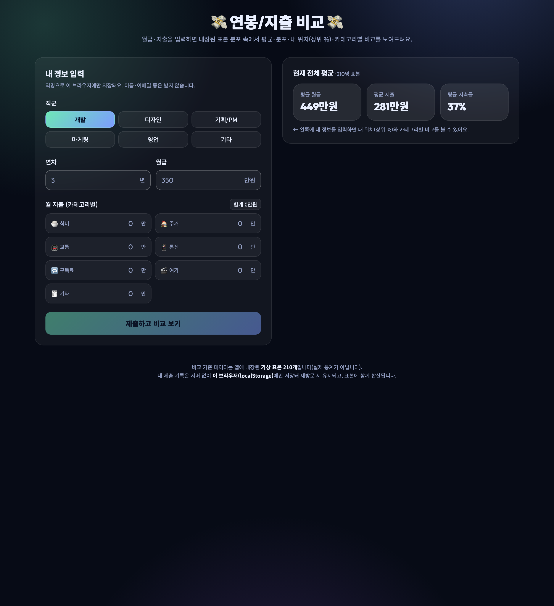
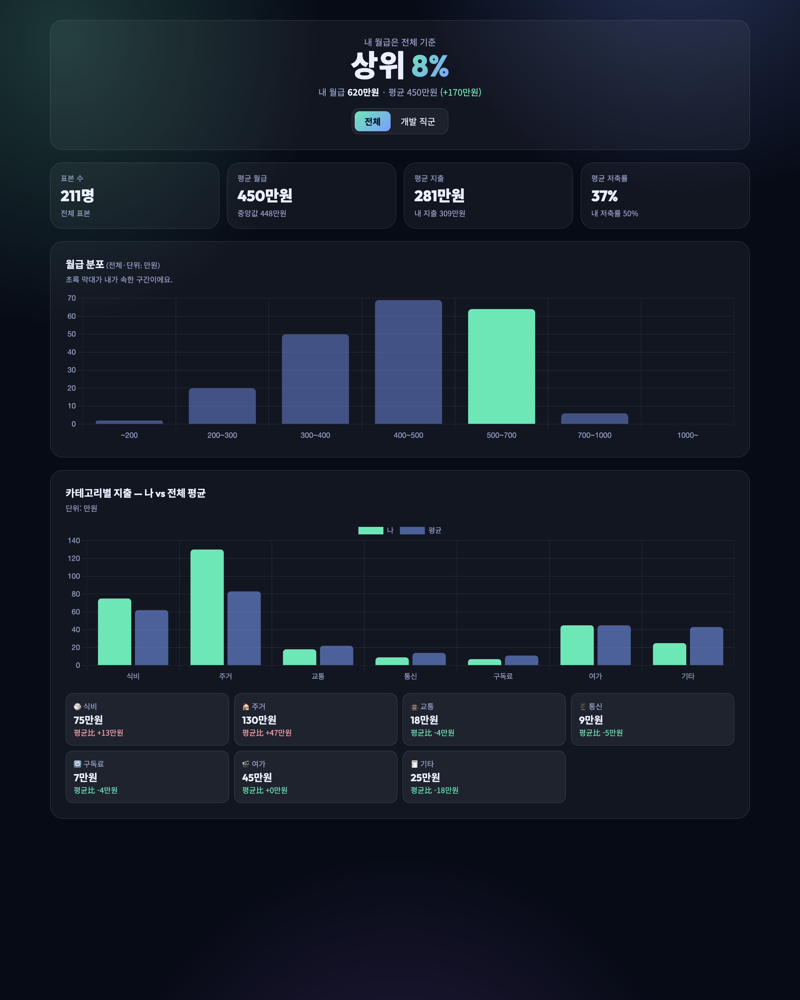

# 💸 연봉/지출 비교 — 단일 파일(서버리스) 버전

월급·지출·직군·연차를 입력하면, 앱에 **내장된 가상 표본 분포**(210개) 속에서
**내 위치(상위 몇 %)** 와 **카테고리별 지출**을 한눈에 비교해 주는 웹앱입니다.

기존 풀스택 버전(`../06_salary_compare`)을 **백엔드/DB 없이** 단일 `index.html` 로 새로 만든 것입니다.
서버·번들러·빌드 도구 없이 브라우저에서 파일을 열기만 하면 동작합니다.

## 화면

**① 입력 화면** — 직군·연차·월급·카테고리별 지출 입력 (제출 전에도 내장 표본의 전체 평균 미리보기)



**② 결과 화면** — 내 위치(상위 %), 월급 분포 히스토그램(내 구간 강조), 카테고리별 나 vs 평균 비교



## 원본과의 차이 (서버리스 전환)

| 항목 | 원본(풀스택) | 이 버전(단일 파일) |
|------|--------------|--------------------|
| 비교 기준 데이터 | PostgreSQL(PGlite/Supabase)에 쌓인 익명 제출 | **앱에 내장한 가상 표본 210개** |
| 통계 계산 | Express 서버(`/api/stats`, `/api/submissions`) | **브라우저에서 직접 계산** (원본 `buildStats`/`salaryPercentile` 로직 그대로 이식) |
| 내 제출 저장 | 서버 DB | **localStorage** (이 브라우저에만, 재방문 시 유지) |
| 차트 | Chart.js (CDN) | Chart.js (CDN) — 동일 |

> 통계 계산식(평균·중앙값·분포·저축률·상위 %)은 원본 `server.js` 와 **동일**합니다.
> 바뀐 것은 “행(row)이 어디서 오는가” 뿐입니다: DB → (내장 표본 + localStorage).

## 핵심 구현

### 1) 내장 샘플 분포 데이터셋 (`makeSampleRows`)
- **결정적(seeded) 생성기**(mulberry32 PRNG)로 210개 가상 표본을 만듭니다 → 새로고침해도 항상 동일.
- 6개 직군에 32~42개씩 분배해 **전체 / 직군 토글**이 모두 의미를 갖습니다.
  (예: 개발/PM 평균 ~485만원, 기타 ~355만원)
- 월급은 직군별 베이스 + 정규분포 근사 노이즈 + 연차 가산 → 분포 구간(`~200`…`1000~`)이 자연스러운 종 모양.
- 지출은 월급의 45~80%를 카테고리 비중(주거 30%·식비 22%·여가 16%…)으로 분배 → **대부분 저축률이 양수**.

### 2) localStorage 처리
- 키 `salary_compare_single_submissions_v1` 에 내 제출 기록을 배열로 저장.
- 앱 로드 시 `loadMyRows()` 로 복원하고, 통계는 항상 **`[...내장표본, ...내기록]`**(`combinedRows`)으로 계산.
- 제출 흐름(원본과 동일하게 “내 제출 포함”):
  1. 입력값 정리(`toInt`/`normJob`) → 내 행 1건 생성
  2. localStorage에 **먼저 append** 후 그 전체로 `buildStats`/`salaryPercentile`
  3. 이중 합산 방지를 위해 “한 번만 append → 전체를 읽어 계산” 원칙 유지
- `🗑️ 내 기록 초기화` 버튼으로 localStorage 기록을 비울 수 있습니다.
- 푸터에 “내장 가상 표본이며 실제 통계가 아님 / 기록은 이 브라우저에만 저장”을 작게 명시.

### 3) 시각화 (원본 그대로)
- `ChartBox`: Chart.js 캔버스가 첫 페인트에서 폭 0으로 잡히는 문제를 `requestAnimationFrame(resize)` 로 해결.
- 월급 분포: 내가 속한 구간만 초록색 강조(`myBucket` ↔ `SALARY_BUCKETS` 정렬 유지).
- 카테고리: 나 vs 평균 막대 + 평균比 카드.

## 실행 방법

빌드 도구 불필요. 다음 중 하나로 열면 됩니다.

```bash
# 1) 정적 서버 (권장)
npx serve .
#  → http://localhost:3000

# 2) VS Code Live Server 확장으로 index.html 열기

# 3) 그냥 브라우저로 index.html 더블클릭해도 동작 (CDN 사용)
```

## 기술 스택

- React 18.3.1 + ReactDOM (CDN, UMD)
- Babel Standalone 7.25.9 (인라인 JSX 변환 — 8.x 미지원이라 7.x 고정)
- Tailwind CSS 3.4.16 (CDN)
- Chart.js 4.4.1 (CDN)
- **단일 `index.html`** — 서버/번들러/DB 없음, 모든 CDN 버전 고정
