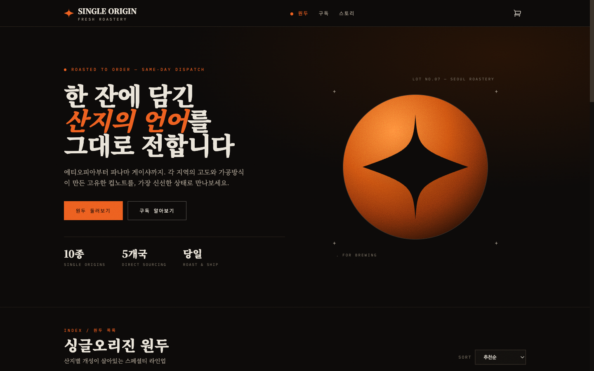
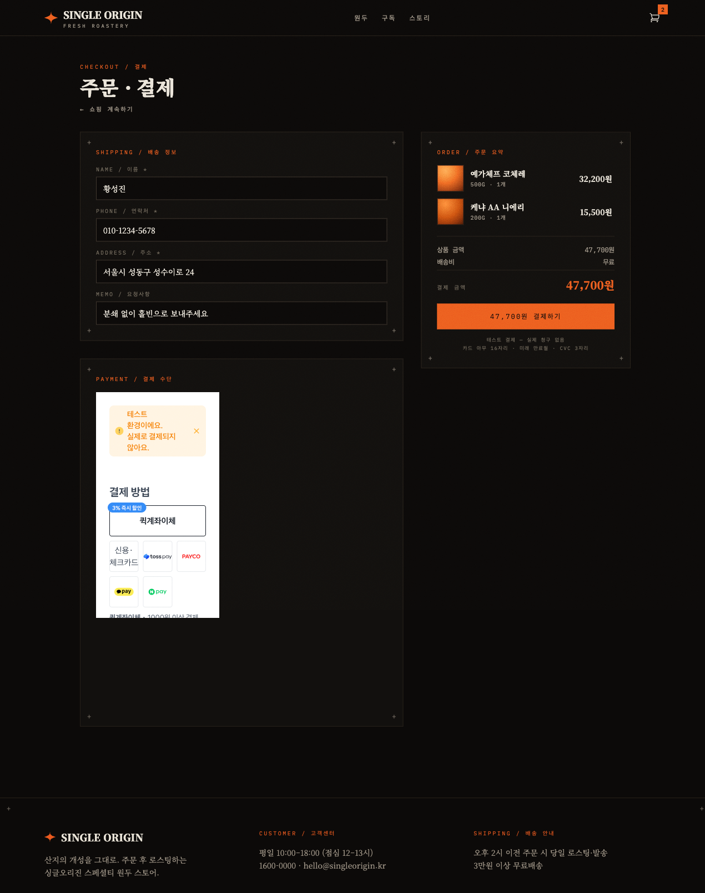
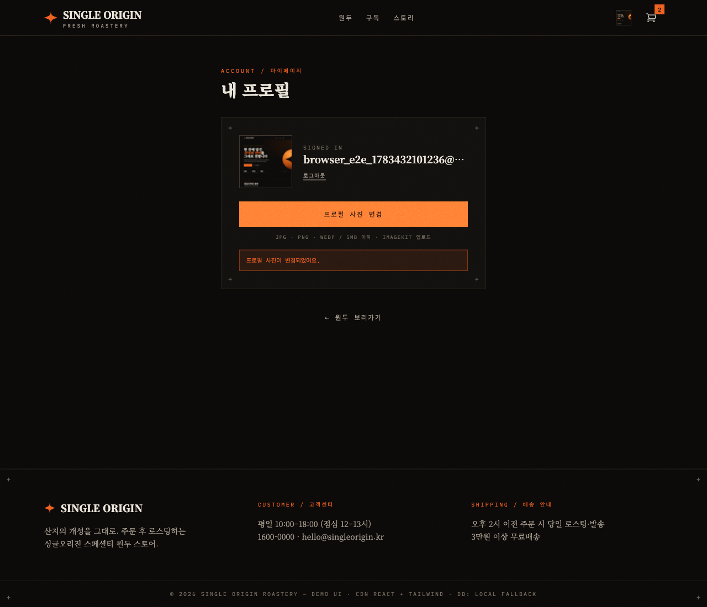
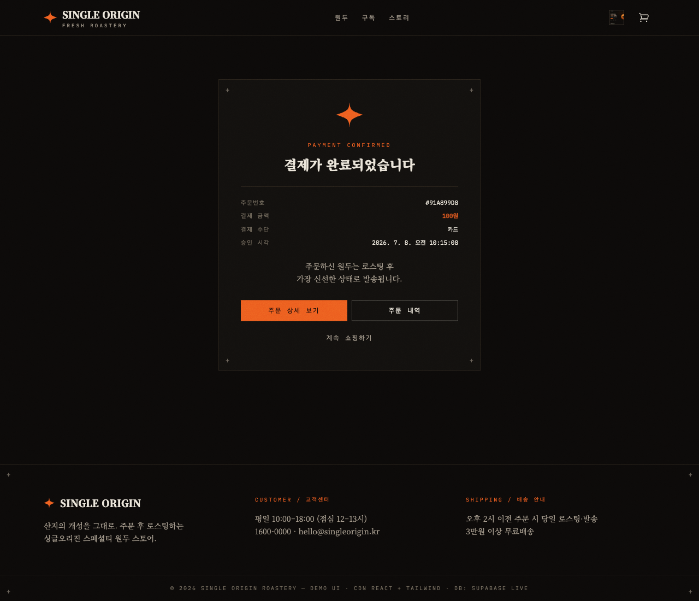
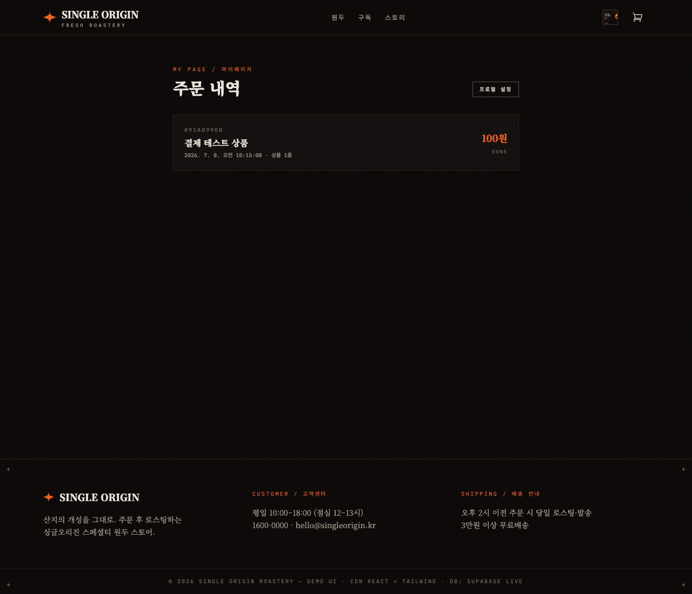
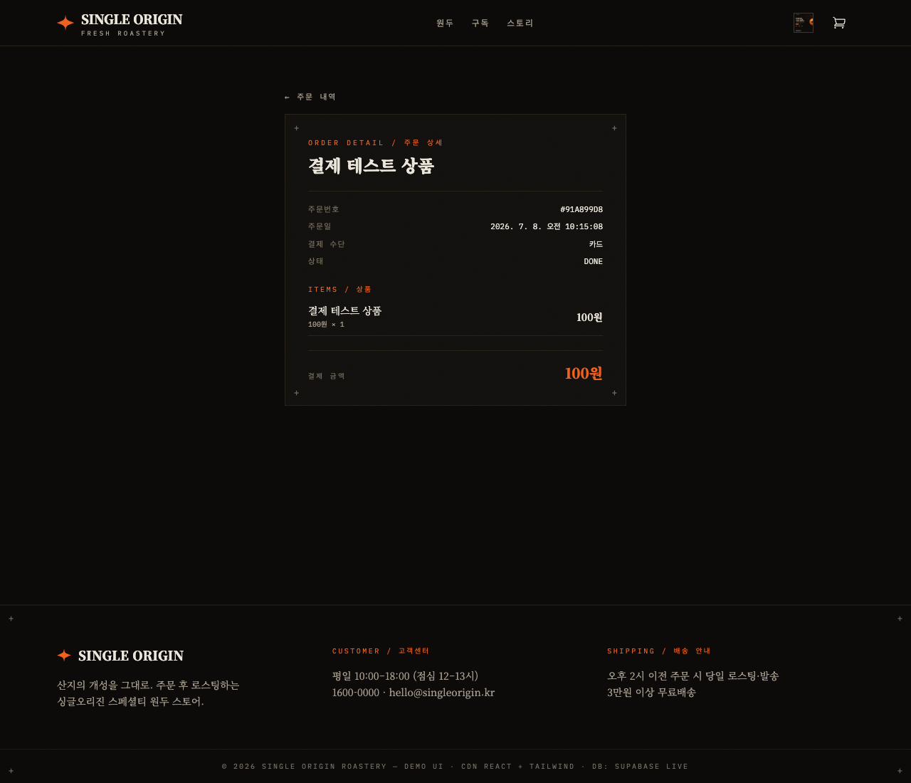
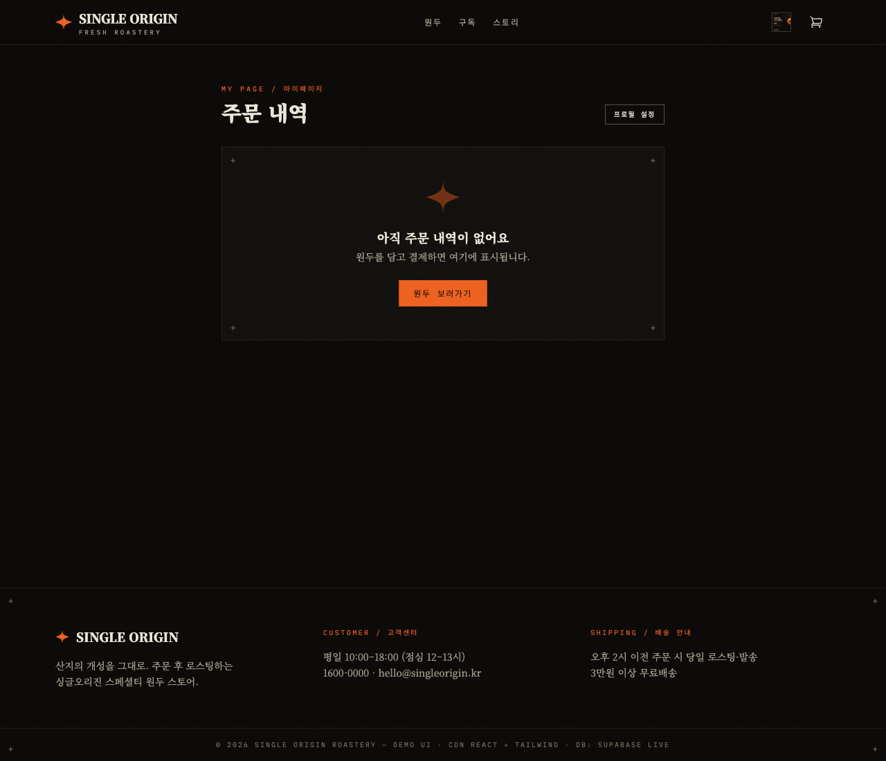

# ☕ SINGLE ORIGIN — 싱글오리진 원두 쇼핑몰 UI

CDN 기반 React 18 + Tailwind CSS로 만든 **단일 `index.html`** 자기완결형 웹앱입니다.
빌드 도구 없이 로컬 서버로 파일 하나만 열면 바로 동작합니다.

## 디자인 스타일 (2026-07-07 리디자인)

Pinterest 레퍼런스 3장을 기반으로 한 **그레인 에디토리얼 포스터** 스타일:

- **팔레트** — 잉크 블랙(`#0C0A09`) 배경 + 번트 오렌지(`#EB5A1E`) + 페이퍼 아이보리(`#E8E2D6`) + 실버 듀오톤
- **텍스처** — SVG `feTurbulence` 필름 그레인을 화면 전체와 상품 비주얼에 오버레이 (외부 이미지 없음)
- **타이포** — 세리프 디스플레이(Noto Serif KR 900) 헤드라인 + 모노스페이스(IBM Plex Mono) 대문자 잔글씨 캡션
- **모티프** — 4포인트 스타버스트(스파크) SVG, "+" 레지스트레이션 마크, `. FOR BREWING` 같은 인쇄물풍 마이크로카피
- **형태** — 라운드 없는 사각 카드/버튼, 1px 헤어라인 보더

상품 비주얼은 원두별로 오렌지/실버/차콜 듀오톤 라디얼 그라디언트 + 그레인 + 블랙 스파크로 통일했습니다.

## 주요 기능

- **헤더/네비게이션** — 스파크 로고, 원두/구독/스토리 메뉴(모노 대문자), 장바구니 아이콘(수량 뱃지), 모바일 햄버거 메뉴
- **히어로 섹션** — 에디토리얼 포스터 컴포지션(오렌지 그레인 구체 + 블랙 스파크), 세리프 카피 + CTA 버튼
- **원두 상품 목록(그리드)** — 10종 싱글오리진 샘플 데이터
  - 원산지(에티오피아 예가체프·시다모, 콜롬비아 우일라, 케냐 AA, 과테말라 안티구아, 코스타리카 따라주, 브라질 세하도, 파나마 게이샤, 니카라과, 인도네시아 만델링)
  - 로스팅 정도(라이트/미디엄/다크), 컵노트(테이스팅 노트), 무게 옵션(200g/500g/1kg)별 가격
  - 카드에서 바로 무게 선택 + 장바구니 담기
- **필터 / 정렬** — 로스팅 정도별 필터, 추천순·가격순·로스팅순 정렬 (인터랙티브)
- **장바구니 드로어** — 담기/수량 변경/삭제/전체비우기, 합계·배송비(3만원 이상 무료) 자동 계산, `localStorage` 유지
- **주문(체크아웃)** — 배송정보 폼 → Supabase `orders`/`order_items` 저장 → 주문번호 발급
- **상품 상세 모달** — 원산지 스토리, 재배 고도, 가공방식(워시드/내추럴/허니), 품종, 추천 추출법, 수량·무게 선택 후 담기
- **로그인 · 마이페이지** — 서버 자체 인증(이메일/비번), 프로필 사진을 **ImageKit에 업로드**해서 변경 (아래 전용 섹션)
- **해시 라우팅** — `/#/`, `/#/beans`, `/#/subscribe`, `/#/story`, `/#/checkout`, `/#/account`
- **구독 페이지 / 스토리 페이지** — 정기구독 플랜, 브랜드 스토리
- **반응형** — 모바일/태블릿/데스크탑 대응
- **원두 비주얼** — 외부 이미지 없이 듀오톤 그라디언트 + 그레인 + 스타버스트 SVG로 표현

## Supabase 연동 (2026-07-07)

프로젝트 `puqsjbrnacfepitknauf`에 아래 스키마가 생성돼 있고, 앱은 DB 우선 + 실패 시 내장 폴백으로 동작합니다.

| 테이블 | 용도 | RLS |
|--------|------|-----|
| `beans` | 원두 카탈로그 10종 (이름·산지·로스팅·가격·컵노트·그라디언트·품절 여부) | 누구나 읽기 |
| `orders` | 주문 (배송정보, 합계, 상태: pending→roasting→shipped→done) | 삽입만 허용 (조회 불가) |
| `order_items` | 주문 상세 (원두, 무게, 수량, 단가) | 삽입만 허용 |

- 주문 id는 클라이언트에서 `crypto.randomUUID()`로 생성 → RETURNING 없이 insert-only RLS로 동작
- "주문하기" → 배송정보 폼 → `orders` + `order_items` 저장 → 주문번호 표시, 장바구니 비움
- 푸터에 현재 데이터 소스 표시: `DB: Supabase live` / `Local fallback`

**활성화 방법**: 아직 anon key가 비어 있어 폴백 모드로 동작 중.
Supabase 대시보드 → Settings → API Keys의 anon public 키를 `index.html`의
`SUPABASE_KEY = '__SUPABASE_ANON_KEY__'` 자리에 넣으면 라이브 전환됩니다.

## 💳 토스페이먼츠 결제위젯 연동 (2026-07-07)

장바구니 → **결제하기** → 토스페이먼츠 **결제위젯(v2 SDK)** → 서버 결제 승인까지 실제 연동돼 있습니다.
공식 문서용 **테스트 상점 키**를 사용하며 실제 청구는 발생하지 않습니다.

### 결제 플로우

```
1. 장바구니 드로어 → "결제하기"                         (클라이언트)
2. /#/checkout 페이지: 배송정보 입력 + 결제위젯 렌더링    (클라이언트, 위젯 1회 렌더)
3. "결제하기" 클릭 전 → POST /api/orders 로 기대 금액 등록 (서버가 신뢰할 금액 기록)
4. widgets.requestPayment() → 토스 결제창                (customerKey: ANONYMOUS 비회원)
5. 결제 완료 → successUrl(/#/payments/success)로 리다이렉트
6. 성공 페이지 → POST /api/confirm                       (클라이언트)
7. 서버: 등록 금액과 대조 → 시크릿 키로 토스 승인 API 호출  (서버 전용)
8. 승인 성공 → 장바구니 비우기 + 결과 표시                 (실패 시 /#/payments/fail)
```

### 보안 설계

- **시크릿 키는 서버(`.env`)에서만** 사용합니다. 클라이언트 번들에는 클라이언트 키(공개 키)만 존재합니다.
- **금액 위변조 방지**: 결제 요청 직전에 서버가 기대 금액을 기록하고, 승인 시 `orderId`별 금액을 대조한 뒤에만 토스 승인 API를 호출합니다. (데모 스코프라 in-memory `Map` 사용 — 서버 재시작 시 초기화)
- **재승인(새로고침) 방지**: 승인 성공 후 `history.replaceState`로 `location.search`의 민감 파라미터(paymentKey 등)를 제거하고, 재요청 시 토스의 `ALREADY_PROCESSED_PAYMENT`를 정상 완료로 처리합니다.
- `.env`는 `.gitignore` 처리됨 (`.env.example`만 커밋). `git check-ignore .env`로 확인 가능.

### ⚠️ 해시 라우팅 주의점 (반영 완료)

이 앱은 해시 라우팅(`/#/...`)을 씁니다. 토스는 `successUrl`에 hash가 있으면
`paymentKey`/`orderId`/`amount`를 **hash 앞의 `location.search`**에 붙입니다.
따라서 성공/실패 페이지는 `location.search`와 hash 내부 쿼리를 **둘 다** 병합하는
`parseHashQuery()` 헬퍼로 파싱합니다. 이게 없으면 결제 후 파라미터가 전부 `undefined`가 됩니다.

### 테스트 카드

- 카드번호: 아무 16자리 (예: `4330000000000005`)
- 유효기간: 미래의 아무 월/년, CVC: 아무 3자리, 비밀번호 앞 2자리: 아무 값
- 테스트 결제는 자정에 자동 취소됩니다.

### 키 교체

기본값은 토스 공식 문서용 테스트 상점 키입니다. 본인 상점 키로 바꾸려면:
- 클라이언트 키: `index.html`의 `TOSS_CLIENT_KEY`
- 시크릿 키: `.env`의 `TOSS_SECRET_KEY`

## 👤 로그인 · 프로필 사진 (ImageKit 업로드) (2026-07-07)

로그인한 사용자가 자기 **프로필 사진을 ImageKit에 올려서 바꾸는** 기능입니다.

### 아키텍처 (Supabase Auth 아님 — 서버 자체 인증)

```
[브라우저]                         [Express server.js]                 [외부]
로그인/회원가입  ──POST /api/auth/*─▶ bcrypt 해시 + JWT 세션(httpOnly)  ─▶ Postgres(app_users)
마이페이지 진입  ──GET  /api/me ────▶ 쿠키 검증 → user + avatar_url     ─▶ Postgres(app_profiles)
사진 선택        ──GET  /api/imagekit-auth▶ private 키로 서명(token/expire/signature)
                  ──직접 업로드────────────────────────────────────────▶ ImageKit upload API
                  ◀── 업로드된 이미지 url
url 저장         ──POST /api/me/avatar ─▶ app_profiles.avatar_url 갱신  ─▶ Postgres
```

- **인증**: Supabase Auth를 쓰지 않습니다. Express가 **Postgres(`DATABASE_URL`)에 직접 붙어** bcrypt로 비밀번호를 해시하고, 세션은 **httpOnly 쿠키에 담은 JWT**로 관리합니다. `app_users` / `app_profiles(avatar_url)` 테이블은 서버 기동 시 `CREATE TABLE IF NOT EXISTS`로 자동 생성됩니다.
- **ImageKit**: **private 키는 서버 `.env`에만** 둡니다. 서버가 서명(`/api/imagekit-auth`)만 내려주고, **브라우저가 파일을 ImageKit에 직접 업로드**합니다(파일이 우리 서버를 거치지 않음). 업로드 응답의 `url`을 프로필에 저장하고, 표시할 때 `?tr=w-240,h-240,fo-auto` 변환으로 정사각 썸네일을 만듭니다.
- **비회원/미설정 그레이스풀 처리**: 서버에 `DATABASE_URL`이 없으면 로그인이 비활성화되고 안내 배너가 뜹니다. ImageKit 키가 없으면 업로드 버튼이 비활성화됩니다. **어느 경우든 쇼핑·결제는 정상 동작**합니다. 활성/비활성 상태는 `GET /api/config`(`{authEnabled, imagekitEnabled}`)로 판단합니다.

### profiles/users 테이블

서버가 자동 생성하지만, 참고용 스키마는 다음과 같습니다(적용 SQL은 아래 "키 끼우는 곳" 참고).

| 테이블 | 컬럼 |
|--------|------|
| `app_users` | `id uuid pk`, `email unique`, `password_hash`, `created_at` |
| `app_profiles` | `user_id uuid pk → app_users(id)`, `avatar_url`, `updated_at` |

## 🧾 주문 저장 · 마이페이지 주문 내역 (2026-07-08, 부트캠프 과제)

토스 결제 승인이 성공하면 주문을 **Postgres에 저장**하고, 로그인 사용자가 **마이페이지에서 자기 주문 내역**을 봅니다.

- **결제 = 로그인 필요**: 마이페이지에서 주문을 확인하려면 결제 전에 로그인해야 합니다. `/#/checkout`은 비로그인 시 로그인 안내를 띄웁니다.
- **저장 흐름**: `/api/orders`가 주문을 `PENDING`으로 저장(+상품 items) → `/api/confirm` 승인 성공 시 `DONE`으로 전환하고 `payment_key/method/paid_at` 기록. `user_id`는 **세션 쿠키에서 서버가 도출**(위변조 불가).
- **테이블**: `app_orders`(id, order_id, user_id, order_name, amount, status, payment_key, method, paid_at) / `app_order_items`(order_ref, product_name, qty, unit_price) — 기존 Supabase `orders`(구스키마)와 충돌 피하려 `app_` 접두사.
- **마이페이지(`/#/mypage`)**: `WHERE user_id = 현재 사용자`로 격리, `paid_at DESC` 최신순, 주문번호는 `#` + 앞 8자리(`#91A899D8`), 0건이면 "아직 주문 내역이 없어요" 빈 상태.
- **주문 상세(`/#/orders/:id`)**: 상품별 수량·단가·합계 + 주문번호/주문일/결제수단/금액. 남의 주문 id로 접근하면 404.
- **100원 테스트 결제**: 장바구니(빈 상태) 또는 결제 페이지의 "⚙ 100원 테스트 결제 담기" 버튼 → 배송비 없이 정확히 100원 결제. 토스 테스트 카드는 **VISA/MASTER(해외카드)** 선택 시 카드번호 직접 입력창이 뜹니다(예: `4242 4242 4242 4242`, 미래 만료월, 이메일). 국내 카드사는 앱 인증이 필요하므로 해외카드 입력 방식을 권장.

## 라우트

| 경로 | 화면 |
|------|------|
| `/#/` | 홈 (히어로 + 원두 목록) |
| `/#/beans` | 원두 목록 (필터/정렬) |
| `/#/subscribe` | 정기구독 플랜 |
| `/#/story` | 브랜드 스토리 |
| `/#/checkout` | 결제 페이지 (로그인 필요 · 배송정보 + 토스 결제위젯) |
| `/#/payments/success` | 결제 승인 결과 (성공/실패 분기) |
| `/#/payments/fail` | 결제 실패 (code/message 표시) |
| `/#/account` | 프로필 (로그인/프로필 사진 변경) |
| `/#/mypage` | 마이페이지 — 주문 내역 (최신순, 빈 상태) |
| `/#/orders/:id` | 주문 상세 (상품 수량/단가/합계) |

## 실행 방법

Express 서버 하나가 **정적 파일 + 결제 승인 + 자체 인증 + ImageKit 서명**을 모두 담당합니다.

```bash
cd bean-shop

# 1) 의존성 설치 (express, dotenv, pg, bcryptjs, jsonwebtoken, cookie-parser, imagekit)
npm install

# 2) 환경변수 준비 — .env.example을 복사해 값 채우기
cp .env.example .env

# 3) 서버 시작
npm start
# → http://localhost:3000  (반드시 이 주소로 접속 — /api/* 가 여기에만 있음)
```

기동 로그에서 각 기능 활성 여부를 확인할 수 있습니다:
```
토스 결제:  ON
자체 인증:  ON        ← DATABASE_URL 이 있으면 ON
ImageKit:   ON        ← IMAGEKIT_PRIVATE_KEY 가 있으면 ON
```

### 🔑 키 끼우는 곳 (단계별)

| 값 | 위치 | 설명 |
|----|------|------|
| **ImageKit private 키** | 서버 `.env` → `IMAGEKIT_PRIVATE_KEY` | 절대 클라이언트에 두지 말 것 |
| **ImageKit public 키 / URL endpoint** | 클라이언트 `index.html` 상단 `CONFIG` + 서버 `.env` | 공개 값 |
| **DB 접속 문자열** | 서버 `.env` → `DATABASE_URL` | Supabase → Settings → Database → Connection string (pooler, 6543) |
| **세션 서명 키** | 서버 `.env` → `SESSION_SECRET` | 긴 랜덤 문자열 |
| **토스 시크릿 키** | 서버 `.env` → `TOSS_SECRET_KEY` | 서버 전용 |
| **토스 클라이언트 키** | 클라이언트 `index.html` → `TOSS_CLIENT_KEY` | 공개 값 |
| (선택) **Supabase publishable 키** | 클라이언트 `index.html` `CONFIG.SUPABASE_KEY` | beans/orders 라이브용. 없으면 내장 폴백 |

> 인증/프로필 테이블은 서버가 자동 생성하므로 별도 SQL 실행은 필수가 아닙니다.
> 수동으로 만들려면 아래 SQL을 대상 DB에 적용하세요:
>
> ```sql
> CREATE TABLE IF NOT EXISTS app_users (
>   id uuid PRIMARY KEY DEFAULT gen_random_uuid(),
>   email text UNIQUE NOT NULL,
>   password_hash text NOT NULL,
>   created_at timestamptz DEFAULT now()
> );
> CREATE TABLE IF NOT EXISTS app_profiles (
>   user_id uuid PRIMARY KEY REFERENCES app_users(id) ON DELETE CASCADE,
>   avatar_url text,
>   updated_at timestamptz DEFAULT now()
> );
> ```

> 결제 없이 UI만 볼 거라면 정적 서버로도 열 수 있지만, `/api/*`가 없어 결제·로그인·업로드는 동작하지 않습니다.

### API 엔드포인트 (server.js)

| 메서드/경로 | 역할 |
|-------------|------|
| `GET /api/config` | 기능 활성 여부 (`{authEnabled, imagekitEnabled}`) |
| `POST /api/auth/signup` · `login` · `logout` | 자체 인증 (bcrypt + JWT httpOnly 쿠키) |
| `GET /api/me` | 로그인 사용자 + `avatar_url` |
| `POST /api/me/avatar` | 프로필 사진 URL 저장 (`{avatarUrl}`) |
| `GET /api/imagekit-auth` | ImageKit 업로드 서명 (`token/expire/signature/publicKey`) |
| `POST /api/orders` | 주문 PENDING 저장 + 기대 금액 기록 (`{orderId, amount, orderName, items}`) |
| `POST /api/confirm` | 금액 대조 → 토스 승인 → 주문 DONE 저장, 내부 `order.id` 반환 |
| `GET /api/me/orders` | 내 주문 목록 (`user_id` 격리, `paid_at DESC`) |
| `GET /api/me/orders/:id` | 내 주문 상세 (상품 포함, 남의 주문은 404) |

```bash
# 승인 엔드포인트 형식 검증 예시 (실제 결제 없이)
curl -X POST http://localhost:3000/api/orders  -H "Content-Type: application/json" \
  -d '{"orderId":"bean_test_001","amount":49000}'
curl -X POST http://localhost:3000/api/confirm -H "Content-Type: application/json" \
  -d '{"paymentKey":"fake","orderId":"bean_test_001","amount":49000}'
# → 금액 통과 후 토스 승인 시도, 가짜 키라 NOT_FOUND_PAYMENT_SESSION 반환(정상 동작 확인)
```

### 자주 겪는 오류

> **"결제 요청 중 오류: 주문 등록에 실패했어요..."** / "결제 서버에 연결할 수 없어요"
>
> 대부분 **접속 주소(origin)가 틀린 경우**입니다. 결제 API(`/api/*`)는 `server.js`가 서빙하는
> **`http://localhost:3000`** 에서만 존재합니다. VS Code Live Server(`:5500`),
> `python -m http.server`(`:8080`), `file://` 로 열면 `/api/orders`가 없어 실패합니다.
>
> **해결**: 터미널에서 `npm start` 후 반드시 **`http://localhost:3000`** 으로 접속하세요.
> (에러 메시지에 현재 열려 있는 origin이 함께 표시되도록 되어 있습니다.)

## 기술 스택

- **React 18** (UMD, CDN)
- **ReactDOM 18** (UMD, CDN)
- **Babel Standalone v7** (`type="text/babel"` JSX 트랜스파일 — v8은 렌더 깨짐 이슈로 v7 핀)
- **Tailwind CSS** (Play CDN, 커스텀 `ink`/`paper`/`flame` 컬러 팔레트)
- **폰트** — Noto Serif KR + IBM Plex Mono (Google Fonts CDN)
- **Supabase** (`@supabase/supabase-js@2` CDN) — 원두 카탈로그 로드 + 주문 저장, RLS 보호
- **토스페이먼츠 결제위젯 v2** (`js.tosspayments.com/v2/standard`) — 결제수단·약관 위젯 + 결제 요청
- **ImageKit** (`js.imagekit`) — 브라우저 직접 업로드(서버 서명) + URL 변환 썸네일
- **Express** (`server.js`) — 정적 서빙 + 결제 승인 + 자체 인증 + ImageKit 서명
  - `pg`(Postgres), `bcryptjs`(비밀번호 해시), `jsonwebtoken`(세션), `cookie-parser`, `imagekit`, `dotenv`
- 상태관리: `useReducer`(장바구니) + `useContext`(Cart/Auth) + `useState`
- 라우팅: 자체 구현 경량 해시 라우터

## 스크린샷



전체 페이지: [screenshots/bean-shop-full.png](screenshots/bean-shop-full.png)

결제위젯 렌더링 (배송정보 + 주문요약 + 토스 결제수단):



마이페이지 — ImageKit 업로드로 프로필 사진 반영:



100원 테스트 결제 성공 · 마이페이지 주문 내역 · 주문 상세 · 빈 상태:






- `POST /api/confirm` 200 OK 및 Postgres 저장 증거: [screenshots/confirm-200-network.txt](screenshots/confirm-200-network.txt)

## 파일 구성

```
bean-shop/
├── index.html          # 앱 전체 (단일 파일) — UI + 결제위젯 + 로그인/마이페이지 클라이언트
├── server.js           # Express: 정적 서빙 + 결제 승인 + 자체 인증(Postgres) + ImageKit 서명
├── package.json        # express, dotenv, pg, bcryptjs, jsonwebtoken, cookie-parser, imagekit
├── .env                # 서버 비밀값 (TOSS_SECRET_KEY, DATABASE_URL, IMAGEKIT_PRIVATE_KEY…) — gitignore
├── .env.example        # .env 템플릿 (커밋됨)
├── .gitignore          # node_modules/, .env 제외 (.env.example만 커밋)
├── README.md           # 이 문서
├── command-input.txt   # 앱 생성·수정 시 입력 명령어
└── screenshots/        # 홈 / 전체 / 결제위젯 / 마이페이지 캡처
    ├── checkout-widget.png        # 결제위젯 렌더링
    └── account-avatar-uploaded.png # ImageKit 업로드 후 프로필
```
