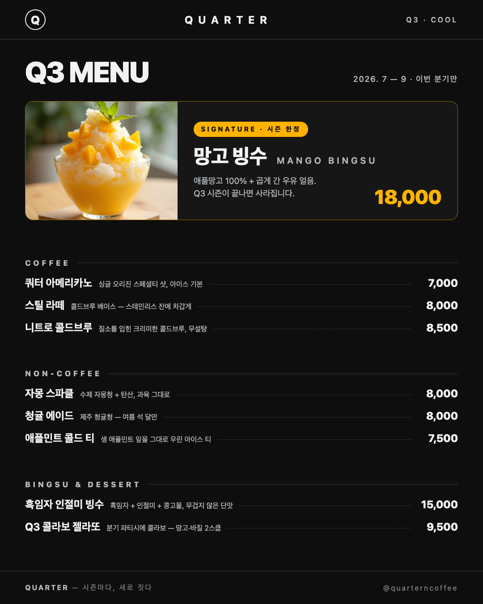

# QUARTER — Q3 · COOL 메뉴판 (7주차 퀘스트 4: 카페 메뉴판 만들기)

노션 원본: https://ruucm.notion.site/Design-d247eb4baa8c823bb57f81527c3193f2

## 카페 컨셉 (한 단락)

**QUARTER**는 블랙과 스테인리스 메탈로 지은 미니멀 프리미엄 카페다. 분기(3개월)마다 메뉴·공간·콜라보 디저트를 통째로 갈아엎는 "시즌마다, 새로 짓다"가 브랜드의 엔진이고, 타겟은 대화와 사진을 위해 방문하는 손님이다. 이번 메뉴판은 Q3(7~9월) `COOL` 시즌 — 빙수와 아이스 중심으로 차가운 무드를 극대화하고, 시그니처 **망고 빙수**(18,000) 하나에만 사진과 강조색(망고 옐로)의 시각적 무게를 몰아줬다. 나머지는 블랙 `#0E0E0E` · 스틸 실버 `#B9BDC1` 두 톤과 시스템 산세리프 1패밀리(웨이트 대비)로 절제했다.

- 5주차 `my_cafe.md` (Week5/01_Cafe/01_브랜드키트) 컨셉 그대로 사용
- 퀘스트 5에서 만든 신메뉴 포스터([react-drawing/index-quarter.html](../react-drawing/index-quarter.html), 인스타 실게시)와 같은 세계관·같은 시그니처

## 산출물

| 파일 | 내용 |
|---|---|
| [`menu.md`](./menu.md) | 메뉴 문서 — 카테고리 3개 · 메뉴 9개 · 가격 |
| [`recipes.md`](./recipes.md) | 메뉴별 레시피 카드 (분량·재료·만드는 법·팁) |
| [`menu-board.html`](./menu-board.html) | 메뉴판 (1080×1350, 단일 파일 — 사진 base64 임베드, A4 인쇄 `@media print`) |
| [`menu-board.png`](./menu-board.png) | 메뉴판 최종 이미지 (헤드리스 크롬 렌더) |
| [`cost-sheet.xlsx`](./cost-sheet.xlsx) | 원가표 — 메뉴별 원가·원가율·마진 (평균 원가율 27.3%) |
| [`menu-data.json`](./menu-data.json) | 원가표 원본 데이터 (수정 시 재사용) |

## 메뉴 구성 요약

- **COFFEE** 3종 (7,000~8,500) · **NON-COFFEE** 3종 (7,500~8,000) · **BINGSU & DESSERT** 3종 (9,500~18,000)
- 가격 존은 my_cafe.md의 프리미엄 기준(아메리카노 6,500~8,000)을 따름
- 평균 원가율 27.3% (25~35% 권장 범위 내, 컵·부자재 포함)
- 시그니처 망고 빙수 원가율 31.7% — 프리미엄 과일 메뉴 특성상 상단, 나머지로 상쇄

## 렌더/인쇄

```bash
# PNG 추출 (1080×1350)
"/Applications/Google Chrome.app/Contents/MacOS/Google Chrome" --headless --hide-scrollbars \
  --screenshot=menu-board.png --window-size=1080,1350 menu-board.html
# A4 인쇄: 브라우저에서 열고 인쇄 (배경 그래픽 켜기)
```

## 스크린샷



- 에이전트 대화: `screenshots/agent-chat-quarter-menu.png`
