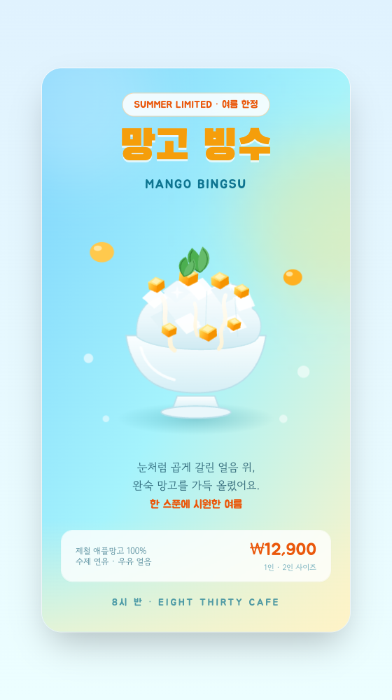
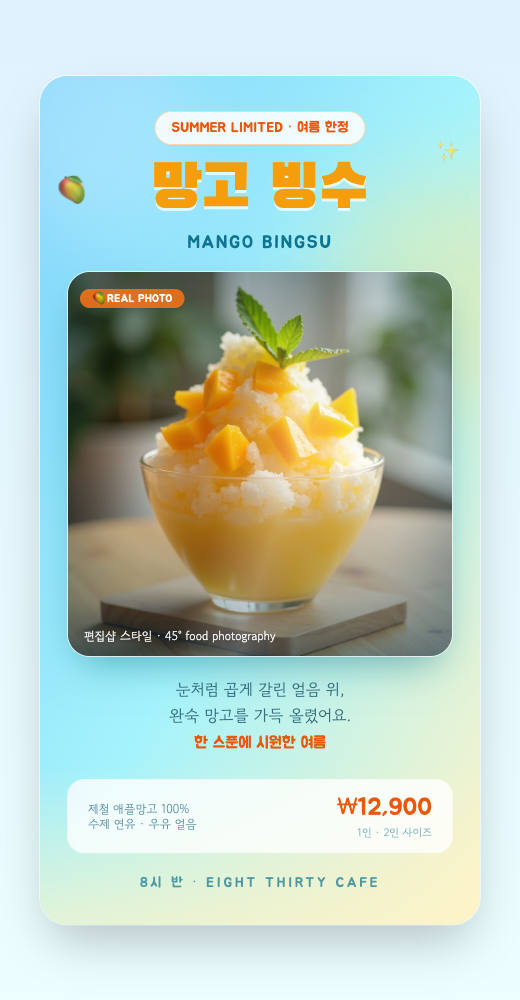
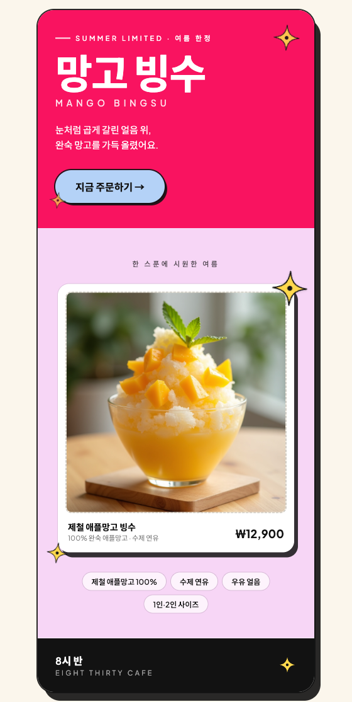
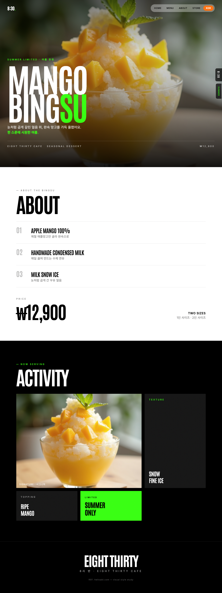

# 망고 빙수 포스터 (Mango Bingsu Poster)

여름 한정 "망고 빙수"를 소개하는 정적 포스터형 단일 파일 React 웹앱.
같은 콘텐츠를 **네 가지 톤앤매너 버전**으로 제공한다.

1. **SVG 일러스트 버전** (`index.html`) — 망고 빙수를 사진이 아니라 **직접 그린 SVG**로 미니멀·플랫하게 표현
2. **실사진 버전** (`index-photo.html`) — fal.ai로 생성한 **실사 망고 빙수 사진**을 프레임 카드로 배치
3. **TimTim 편집숍 스타일 버전** (`index-timtim.html`) — [shop.madebytimtim.co.uk](https://shop.madebytimtim.co.uk/)의 디자인 언어(대담한 색면 대비 + Plus Jakarta Sans + 하늘색 필 버튼)를 레퍼런스로 재해석
4. **helloabt 에디토리얼 스타일 버전** (`mango-bingsu-photo.html`) — [helloabt.com](https://helloabt.com/index.html)의 아트/패션 에이전시 무드(Antonio 압축서체 + 흑백 하이콘트라스트 + 네온 그린 포인트)를 레퍼런스로 재해석

네 버전 모두 타이틀 "망고 빙수 / MANGO BINGSU" / 카피 문구 / 가격·정보 / 하단 "8시 반 · EIGHT THIRTY CAFE" 브랜딩을 공유한다.

## 버전별 미리보기

### 1. SVG 일러스트 버전 — `index.html`



- **직접 그린 SVG 망고 빙수** (컴포넌트로 분리해 가독성 확보)
  - `ShavedIce` — 겹친 다각형 결정 + 봉긋한 곡선 윤곽으로 수북히 쌓인 셰이브드 아이스
  - `MangoCube` / `MangoCubes` — 윗면/옆면/하이라이트로 입체감 준 노랑→주황 그라데이션 큐브
  - `MilkDrizzle` — 얼음 위로 흘러내리는 연유 곡선
  - `MintLeaf` — 꼭대기 민트 잎 장식
  - `Bowl` — 반투명 유리 그릇 + 하이라이트 + 받침
  - `FloatingBits` — 배경에 둥둥 떠다니는 미니 망고/물방울 (은은한 floaty 애니메이션)

### 2. 실사진 버전 — `index-photo.html`



- **fal.ai 생성 실사 사진**(`photos/mango-bingsu-real.jpg`, 유리그릇·곱게 간 얼음·망고 큐브·민트, 45° 편집샵 스타일 food photography)을 메인 비주얼로 사용
- `PhotoFrame` 컴포넌트로 사진을 예쁘게 프레이밍
  - 둥근 모서리 + 깊은 그림자 + 흰색 링
  - 상/하단 그라데이션 오버레이 + 은은한 비네트로 텍스트 가독성 확보
  - 사진 위를 스치는 광택(`sheen`) 애니메이션
  - `🥭 REAL PHOTO` 코너 라벨 + 하단 캡션
  - 로딩 스켈레톤 / 로드 실패 시 대체 UI 처리
- 이미지 경로는 **상대경로**(`photos/mango-bingsu-real.jpg`)로 참조

### 3. TimTim 편집숍 스타일 버전 — `index-timtim.html`



- **레퍼런스**: [shop.madebytimtim.co.uk](https://shop.madebytimtim.co.uk/) — Playwright로 실측한 디자인 스펙을 차용
- **팔레트**(실측): 핫핑크 히어로 `#F91360`, 라벤더 서브 섹션 `#F7D6F6`, 하늘색 필 버튼 `#B4D2F7`, 텍스트 블랙 `rgb(18,18,18)`, 크림 종이 `#FBF6EC`
  - Tailwind 커스텀 컬러(`tt-magenta`/`tt-lavender`/`tt-sky`/`tt-ink`/`tt-cream`)로 `tailwind.config`에 등록해 `bg-`/`text-`/`ring-` 전 접두사에서 사용
- **폰트**: `Plus Jakarta Sans`(Latin) + `Noto Sans KR`(한글 폴백), 헤드라인 semi-bold(600)
- **레이아웃**: 대담한 컬러 블록을 세로로 쌓은 편집숍/잡지 구도
  - 히어로(핫핑크): 자간 넓은 소문자 캡션 → 큰 헤드라인 → 서브카피 → **하늘색 완전 알약 CTA**(border-radius 100px, 검정 텍스트, 오프셋 하드 섀도)
  - 쇼케이스(라벤더): **흰 카드 위에 실사진**을 올려 컬러 블록과 대비 + 점선 스티치 테두리(우편 소품 느낌) + 카드 하단 상품명·가격 캡션 + 재료 태그 칩
  - 노란 **스타버스트 스티커**를 사진/블록 모서리에 포인트로 부착(톡톡 튀는 `pop` 애니메이션)
  - 브랜딩 푸터(블랙): "8시 반 / EIGHT THIRTY CAFE" 대비 바
- 사진은 실사진 버전과 **동일한 `photos/mango-bingsu-real.jpg`를 재사용**, 로딩 스켈레톤/로드 실패 대체 UI 처리

### 4. helloabt 에디토리얼 스타일 버전 — `mango-bingsu-photo.html`



- **레퍼런스**: [helloabt.com/index.html](https://helloabt.com/index.html) — Playwright로 실측한 디자인 스펙을 차용. 아트/패션 에이전시 같은 그런지·시네마틱 하이콘트라스트 에디토리얼 무드가 핵심
- **폰트**: `Antonio`(condensed sans, Google Fonts) — 헤드라인 700 weight, 초대형, **음수 자간(`letter-spacing: -0.04em`)**으로 촘촘하게 압축, 전부 대문자
- **컬러 시스템**: 블랙(`#000`)·화이트(`#fff`) 섹션이 번갈아 나오는 하이콘트라스트 구조, 포인트 컬러로 **네온 그린 `#39FF14`**를 카테고리 라벨/강조 문구에 사용
  - 네온 그린은 가독성상 **어두운/사진 배경 위에서만** 사용(흰 ABOUT 섹션에는 미사용)
- **레이아웃**: 컴팩트 카드가 아니라 **풀블리드 멀티섹션 스크롤 페이지**(히어로 → ABOUT → ACTIVITY → 푸터)
  - 히어로: 풀블리드 실사진 + 시네마틱 다크 그라데이션 오버레이 + 그레인 텍스처 위에 거대한 흰색 Antonio "MANGO / BINGSU" 멀티라인 헤드라인("SU"만 네온 그린)
  - 상단: 반투명 화이트 **필 내비게이션 바**(`rgba(244,244,244,0.35)`) + 끝에 오렌지 포인트 필 버튼("KOR")
  - 우측: 세로 사이드 탭 배지("8:30" / "SUMMER")
  - ABOUT(화이트/블랙): 96px급 Antonio 헤드라인 + 넘버링된 재료 리스트(애플망고 100% · 수제 연유 · 우유 얼음) + 초대형 가격 `₩12,900`
  - ACTIVITY(블랙/화이트): 흑백 사진 그리드 + 네온 그린 "SUMMER ONLY" 셀
  - 푸터(블랙): 자간 넓은 "EIGHT THIRTY / 8시 반 · EIGHT THIRTY CAFE"
- 사진은 실사진 버전과 **동일한 `photos/mango-bingsu-real.jpg`를 재사용**, 로딩 스켈레톤/로드 실패 대체 UI 처리

## 공통 특징

- **인터랙션 없는 포스터/아트워크**: 세로 카드형 구도, 타이포 + 카피 + 중심 비주얼 + 정보 바
- 여름 느낌의 파스텔 그라데이션 배경 (하늘 → 시안 → 앰버)
- 한글 폰트: Black Han Sans(타이틀) / Jua(포인트) / Gowun Dodum(본문)
- Tailwind CSS 유틸리티 중심 스타일링, 반응형

## 기술 스택

- CDN 기반 React 18 + ReactDOM + Babel Standalone + Tailwind CSS
- 빌드 도구 없이 단일 HTML 파일로 완결 (버전별로 파일 1개)
- **버전 핀 고정**: `@babel/standalone@7.26.4`, `react@18.3.1`, `react-dom@18.3.1`
  - Babel 8 standalone 은 `text/babel` 결과를 ESM으로 주입해 빈 화면이 나므로 v7로 고정

## 실행 방법

로컬 서버로 열면 됨 (CDN 로드 + 로컬 이미지 참조 때문에 `file://` 직접 열기보다 서버 권장):

```bash
# 방법 1: Python
cd react-drawing
python3 -m http.server 8791
# SVG 버전 :     http://localhost:8791/index.html
# 실사진 버전:    http://localhost:8791/index-photo.html
# TimTim 버전:   http://localhost:8791/index-timtim.html
# helloabt 버전: http://localhost:8791/mango-bingsu-photo.html

# 방법 2: npx serve
npx serve .

# 방법 3: VS Code Live Server 확장으로 index.html / index-photo.html 열기
```

## 파일 구성

```
react-drawing/
├── index.html                          # SVG 일러스트 버전 (단일 파일 React 앱)
├── index-photo.html                    # 실사진 버전 (단일 파일 React 앱)
├── index-timtim.html                   # TimTim 편집숍 스타일 버전 (단일 파일 React 앱)
├── mango-bingsu-photo.html             # helloabt 에디토리얼 스타일 버전 (단일 파일 React 앱)
├── README.md                           # 이 문서
├── command-input.txt                   # 입력한 명령 기록
├── photos/
│   └── mango-bingsu-real.jpg           # fal.ai 생성 실사 망고 빙수 사진
└── screenshots/
    ├── mango-bingsu-poster.png             # SVG 버전 렌더링 캡처
    ├── mango-bingsu-poster-photo.png       # 실사진 버전 렌더링 캡처
    ├── mango-bingsu-poster-timtim.png      # TimTim 스타일 버전 렌더링 캡처
    └── mango-bingsu-photo-helloabt.png     # helloabt 스타일 버전 렌더링 캡처 (풀페이지)
```
</content>
</invoke>
