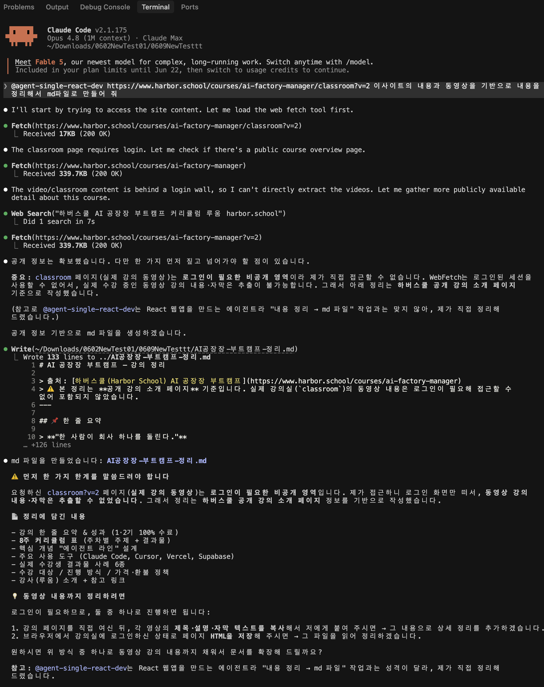

# 📚 나만의 1:1 학습 튜터 (AI Tutor)

내가 제공한 **수업 자료(텍스트 + 실습 코드)** 를 기준으로 답변하는 1:1 맞춤형 AI 학습 에이전트입니다.
API 키를 브라우저에 노출하지 않도록 **Node 프록시 서버**를 통해 Claude API를 호출합니다.



---

## ✨ 주요 기능

- **수업 자료 기반 답변** — 왼쪽 패널에 입력한 `Text Context`(이론)와 `Code Context`(실습 코드)를 우선 참조
- **코드 ↔ 이론 융합 설명** — 이론을 물으면 코드 예시를, 코드를 물으면 이론 배경을 함께 설명
- **실시간 스트리밍** — 답변이 타이핑되듯 출력 (SSE)
- **자동 저장** — 대화·자료를 브라우저 `localStorage`에 보존
- **API 키 보호** — 키는 서버 환경변수(`.env`)에만 존재, 브라우저에 노출 안 됨
- **의존성 없음** — Node 18+ 내장 기능만 사용 (`npm install` 불필요)

---

## 🚀 시작하기

### 1. API 키 준비
[console.anthropic.com](https://console.anthropic.com) 에서 API 키(`sk-ant-...`)를 발급받습니다.

### 2. `.env` 파일 설정
`.env.example` 을 참고해 `.env` 파일에 키를 입력합니다.

```env
ANTHROPIC_API_KEY=sk-ant-api03-여기에_본인_키
PORT=3000
MODEL=claude-opus-4-8
```

### 3. 실행

```bash
npm start
```

> 내부적으로 `node --env-file=.env server.js` 가 실행됩니다 (Node 20+ 권장).

브라우저에서 **http://localhost:3000** 접속 → 바로 사용 가능합니다.

---

## 🗂️ 프로젝트 구조

```
my-ai-tutor-server/
├── server.js          # 정적 서빙 + /api/chat 프록시 (SSE 스트리밍 전달)
├── package.json       # start 스크립트 (--env-file=.env)
├── .env               # 실제 키 (git 제외)
├── .env.example       # 키 템플릿
├── .gitignore         # .env, node_modules 제외
└── public/
    └── index.html     # React + Tailwind 단일 페이지 UI
```

---

## ⚙️ 작동 방식

```
브라우저 ──(POST /api/chat)──▶ Node 서버 ──(x-api-key)──▶ Claude API
   ▲                              │
   └────────  SSE 스트림 그대로 전달 ◀──┘
```

- 시스템 프롬프트(튜터 페르소나 + Text/Code Context)는 **서버에서 조립**
- 모델: `claude-opus-4-8` (환경변수 `MODEL` 로 변경 가능)

---

## 🔒 보안 참고

- `.env` 는 `.gitignore` 에 등록되어 **저장소에 올라가지 않습니다.**
- 공유 시에는 실제 키 대신 `.env.example`(빈 템플릿)만 공유하세요.
- Claude API는 사용량만큼 과금되는 유료 서비스입니다.

---

## 🧩 환경변수

| 변수 | 필수 | 기본값 | 설명 |
|------|:---:|--------|------|
| `ANTHROPIC_API_KEY` | ✅ | — | Anthropic API 키 |
| `PORT` | ❌ | `3000` | 서버 포트 |
| `MODEL` | ❌ | `claude-opus-4-8` | 사용할 Claude 모델 |

---

*브라우저 단독(서버 없는) 버전은 상위 폴더의 `my-ai-tutor/index.html` 을 참고하세요.*
