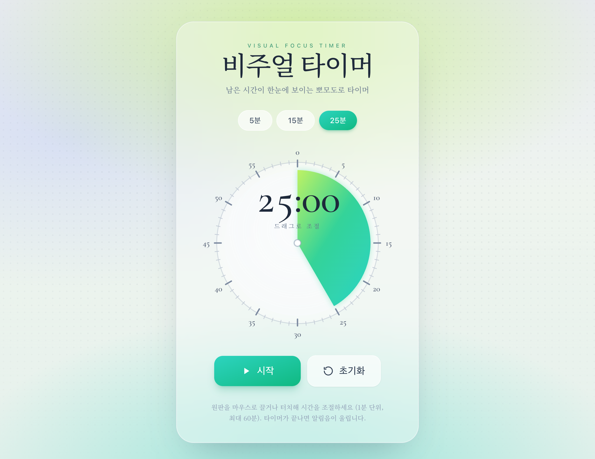
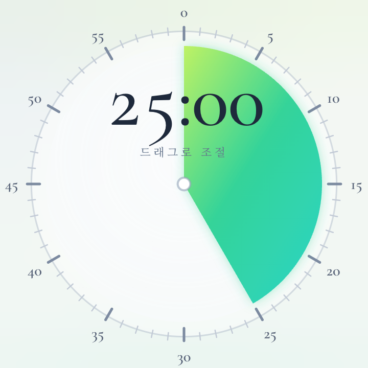
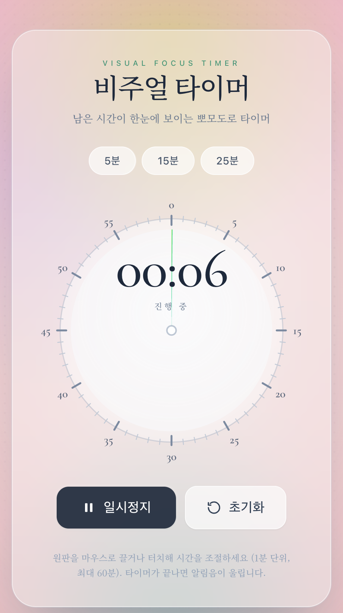

# 비주얼 타이머 (Visual Focus Timer)

남은 시간을 **원형 부채꼴(Time Timer 스타일)**로 한눈에 보여주는 단일 파일 뽀모도로 타이머.
빌드 도구 없이 `index.html` 하나만 브라우저로 열면 바로 실행된다.



## ✨ 주요 기능

- **시각적 타이머 원반** — 남은 시간이 라임→틸 그라데이션 부채꼴로 표시되고, 시간이 흐를수록 12시 방향부터 시계방향으로 줄어든다. 가운데에 `MM:SS` 표시.
- **시간 설정**
  - 5 / 15 / 25분 퀵 버튼
  - **다이얼 드래그**로 직접 조절 (마우스 + 터치, 1분 단위 스냅, 최대 60분)
- **부드러운 카운트다운** — 종료 시각(wall-clock) 기준 `requestAnimationFrame` 구동이라 드리프트가 없고 백그라운드 탭에서도 정확하다.
- **시작 / 일시정지 / 초기화** 컨트롤
- **막판 긴박 효과**
  - 남은 시간 **≤ 10초**: 화면 배경이 **1초 주기**로 깜빡
  - 남은 시간 **≤ 3초**: **0.5초 주기**로 빨라지고, 부채꼴이 **20% 불투명도까지** 펄스
- **알림음** — 종료 시 Web Audio API로 직접 생성한 도-미-솔 차임 (외부 파일 없음).
- **반응형** — 모바일 / PC 모두 대응.

## 🎨 디자인

"New Aesthetic" 무드 — 부드러운 안개 그라데이션 배경(라임·틸·라벤더 글로우) + 하프톤 도트 텍스처 + 프로스티드 글라스 카드 + 세리프 타이포(Cormorant Garamond · Noto Serif KR).

| 다이얼 | 막판 긴박 효과 |
|---|---|
|  |  |

## 🛠 기술 스택

- **React 18** (UMD, CDN) + **Babel Standalone 7** — `type="text/babel"`로 JSX 인라인 변환
- **Tailwind CSS** (CDN)
- **SVG** 부채꼴(`path` arc) · **Web Audio API** 알림음
- 외부 빌드/번들 없음. CDN 버전은 고정(pinned)되어 있다.

> ⚠️ `@babel/standalone`는 반드시 **v7**로 고정해야 한다. 버전을 비우면 Babel 8로 resolve되어 `Cannot use import statement outside a module` 에러로 화면이 깨진다.

## ▶️ 실행 방법

```bash
# 가장 간단: 파일을 브라우저로 바로 열기
open index.html

# 또는 로컬 서버로
npx serve .
```

## 📁 구성

```
myTestApp/
├── index.html          # 앱 전체 (단일 파일)
├── command-inputs.txt  # 생성에 사용한 입력 프롬프트
├── screenshots/        # README용 스크린샷
└── README.md
```
